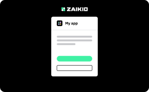
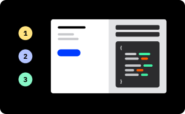
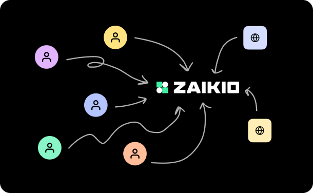

  

    Welcome to the Zaikio developer documentation. You'll find comprehensive guides and documentation to help you start working with Zaikio as quickly as possible, as well as support if you get stuck. Let's jump right in!
  

  

    <RouterLink to="/getting-started/" class="btn btn--cta">Getting started →</RouterLink>
  

<h2 class="u-no-border">Read our guides</h2>

  

    <RouterLink to="/guide/oauth/"></RouterLink>
    <h3>Single Sign-On</h3>
    
Learn how to create a Zaikio account and a Zaikio app. Sign in users with Zaikio. Install an app for an organization.

    
<RouterLink to="/guide/oauth/" class="link">Explore Single Sign-On →</RouterLink>

  

  

    <RouterLink to="/guide/try-api"></RouterLink>
    <h3>Test API requests interactively</h3>
    
Learn how to create a private access token and how to interactively use Zaikio’s API documentations to test.

    
<RouterLink to="/guide/try-api" class="link">Explore Zaikio API requests →</RouterLink>

  

  

    <RouterLink to="/guide/migrate-existing-customers/"></RouterLink>
    <h3>Migrate existing customers</h3>
    
Iteratively migrate your current user database and organisations to Zaikio.

    
<RouterLink to="/guide/migrate-existing-customers/" class="link">Explore migration →</RouterLink>

  

<RouterLink to="/guide/" class="btn">Explore all guides →</RouterLink>

<h2 class="u-no-border">Explore our apps</h2>

<AppList :only-logo="true" :limit="3" />

<RouterLink to="/apps/" class="btn">Explore all apps →</RouterLink>

<h2 class="u-no-border">Try our demo apps</h2>

  

    
Node.js

    <h3>Redirect Flow & Organisation installation</h3>
    

      <a href="https://github.com/crispymtn/zai-demo-node" target="_blank" class="link link--github">crispymtn/zai-demo-node</a>
      <a href="https://node-demonstrator.zaikio.com/" target="_blank" class="link link--demo">node-demonstrator.zaikio.com</a>
    

  

  

    
Javascript / Webpack

    <h3>Redirect Flow SPA</h3>
    

      <a href="https://github.com/crispymtn/zai-demo-app-javascript" target="_blank" class="link link--github">crispymtn/zai-demo-app-javascript</a>
      <a href="https://redirect-flow-demonstrator.zaikio.com/" target="_blank" class="link link--demo">redirect-flow-demonstrator.zaikio.com</a>
    

  

  

    
Javascript / Webpack

    <h3>Device Flow</h3>
    

      <a href="https://github.com/crispymtn/zai-device-flow-demo" target="_blank" class="link link--github">crispymtn/zai-device-flow-demo</a>
      <a href="https://device-flow-demonstrator.zaikio.com/" target="_blank" class="link link--demo">device-flow-demonstrator.zaikio.com</a>
    

  

<h2 class="u-no-border">Libraries</h2>

  

    <a href="https://github.com/crispymtn/zaikio-oauth_client" target="_blank" class="link link--github u-margin-reg-bottom">
      crispymtn/zaikio-oauth_client
    </a>
    

      This gem is a mountable Rails engine that provides single sign on, Zaikio access and further Zaikio platform connectivity
    

    

      
    

  

  

    <a href="https://github.com/crispymtn/zaikio-webhooks" target="_blank" class="link link--github u-margin-reg-bottom">
      crispymtn/zaikio-webhooks
    </a>
    

      Allows to register webhook callbacks for Zaikio Loom for multiple apps as background jobs
    

    

      
    

  

  

    <a href="https://github.com/crispymtn/zaikio-procurement-ruby" target="_blank" class="link link--github u-margin-reg-bottom">
      crispymtn/zaikio-procurement-ruby
    </a>
    

      Ruby API Client for Zaikio Procurement
    

    

      
    

  

<a href="https://github.com/search?q=topic%3Azaikio-gem+org%3Acrispymtn&type=Repositories" target="_blank" class="btn btn--link">Explore all libraries on GitHub →</a>

<h1 class="u-huge">Need help? Get in touch!</h1>

  

    
If you ever need help, please feel free to contact us and join our Slack Zaikio community to stay up to date.

    <a href="https://join.slack.com/t/zaikio-community/shared_invite/zt-g01gvvg2-lk0TcIzkhdtu~xIvRZ5xCw" target="_blank" class="link link--img u-margin-big-bottom">
      
      Join our Slack Community Workspace
    </a>
    <a onclick="Intercom('showNewMessage');" style="cursor:pointer" class="link link--img">
      
      Send us a direct message
    </a>
  

  

    
  

Copyright © 2020 Zaikio GmbH

