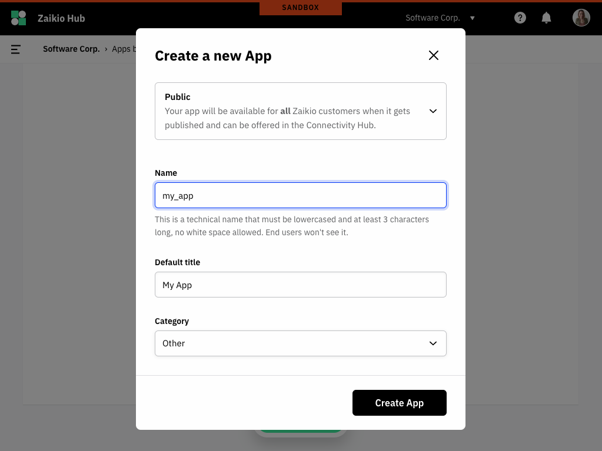

# 1. Setup a Zaikio App

## Setup a developer account

To be able to manage apps you must first create a personal Zaikio account and an organisation in [Zaikio sandbox](https://hub.sandbox.zaikio.com). Afterwards you can access **Developer** in the navigation.

- Make sure that the kind of your organisation is **Software Developer**
- You need to have the **Admin** role in that organisation.

## Create a new app

You can now create a new app in the **Developer** section.

### Types of Zaikio Apps

The integration with the Zaikio platform can be done in different ways. Depending on the requirements of your app, different approaches are possible. First of all you have to decide which type of app is right for you. We distinguish between **public**, **add-on** and **private** apps.

  

#### Public apps

<ul>
<li>Different organisations and people can connect</li>
<li>Must go through Zaikio's app approval process</li>
<li>Can be subscribed to the Zaikio connectivity hub</li>
</ul>

#### Add-ons

<ul>
<li>Different organisations and people can connect</li>
<li>Must go through Zaikio's app approval process</li>
<li>Can be subscribed to the Zaikio connectivity hub together with a parent public app or can be subscribed with a redirect flow within the parent application</li>
</ul>

  

  

#### Private apps

<ul>
<li>Only invited organisations and its members can connect</li>
<li>Don't go through Zaikio's app approval process</li>
<li>Can't be listed in Zaikio's connectivity hub</li>
</ul>

  

#### All types

  
 
    ✔ Can consume APIs and events of other published apps
  

  
 
    ✔ Manage authentication with <strong>OAuth 2.0</strong>  
    ✔ Can offer APIs and events to other Zaikio apps
  

 

### Name

The technical name is used in a variety of areas. The same name can only be used once within Zaikio and is therefore a unique identifier. The name is used in the following areas:

- [JSON Web Tokens](/guide/jwt/) generated with your client credentials will include it as the `aud` attribute in the payload.
- It is used for OAuth scopes that you offer for your API.
- It is used for Events that you offer for your app.

### Default title

This name is the English name of your app and will be visible to your customers in Zaikio. You can translate the name and other attributes into several languages (within the **Translations** tab).

### Category

The category is used to easily find your app in the App Store.

[Continue to integrate the Zaikio SSO ➞](./sso-person.html)

