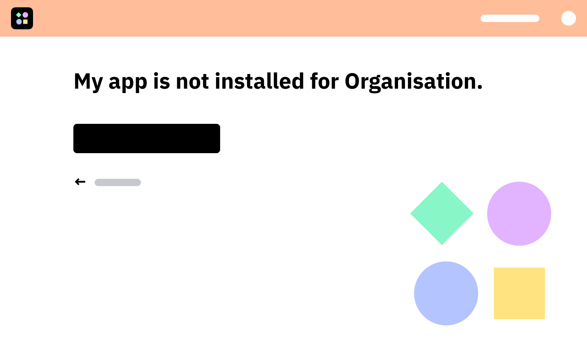
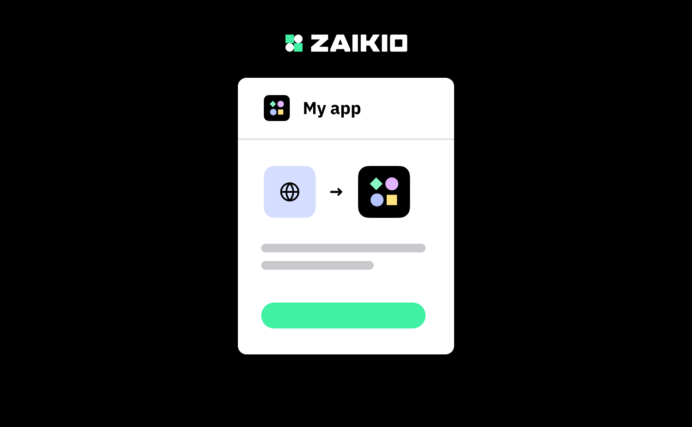
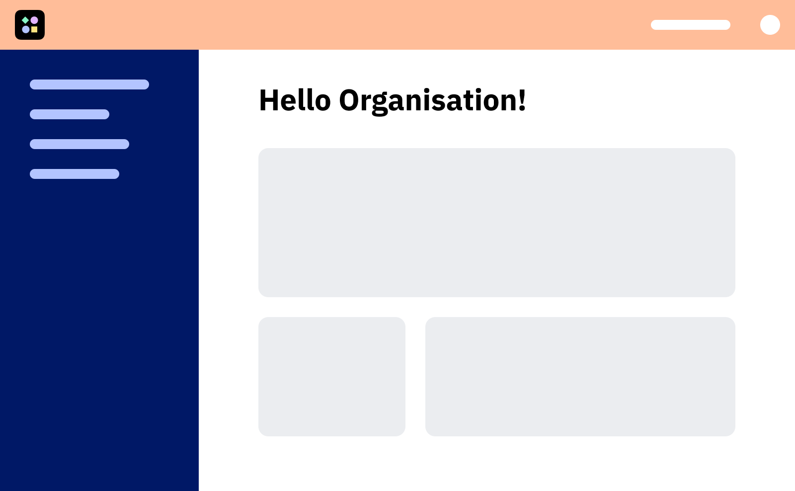

# 4. Install app for organisations

So far we have looked at how individual users can authorise themselves with your app. But usually it is desired to do most of the integrations in the behalf of an organisation instead of a person. If the admin of an organisation installs an app, it will become visible to the employees in Zaikio. Using the data that is already known about the user via [GET `api/v1/person`](/api/directory/directory.html#/Person/getPerson), it is possible to identify to which organisations the user belongs and which roles the member has.

There are two ways for your users to install your app We recommend that you use both of the following options.

The first option is to install the app through the OAuth Redirect Flow with the organisation. This type of flow is necessary if you plan to [migrate an existing user base to Zaikio](/guide/migrate-existing-customers/).

Another way to get your app installed is to offer it on the Zaikio App Store. Here your customers can make purchases via the Zaikio Subscription API in addition to authorisation. You can also offer your app for free in our App Store.

## Option A: Initialize installation through your app

<div class="grid">
<div>
<div class="browser-mockup" data-url="myapp.com/dashboard">


</div>

When users visit your web application after using the SSO from step 2, they will see a personal dashboard with all organisations they are a member of. Which organisations are available for the current person you have requested via [GET `api/v1/person`](/api/directory/directory.html#/Person/getPerson).

</div>

<div>
<div class="browser-mockup" data-url="myapp.com/organizations/my-org">



</div>

If the app is not yet installed for an organisation, you can provide users with an install button if they are an admin of this organisation.

</div>

<div>
<div class="browser-mockup" data-url="hub.zaikio.com/grant">



</div>

The redirect flow is initialised with the organisation and the admin can then grant access to the organisation.

</div>

<div>
<div class="browser-mockup" data-url="myapp.com/organizations/my-org">



</div>

The will be redirected to your website and their organisation dashboard (using a different redirect_uri than in person SSO). You can now perform requests on behalf of the organisation. Usually they will now be able to use all features of your app. :tada:

</div>
</div>

### 4.1 Add organisation scope to desired scopes

It is only possible to request scopes that have been deposited under Desired Scopes. For a complete list of all Hub Scopes please use our [API Specification](/api/directory/directory.html). Of course you can also use other scopes from other apps.

In this example we add the scope `directory.organization.r`.

<div class="browser-mockup" data-url="https://hub.sandbox.zaikio.com/organizations/zaikio/apps/demo_nodejs/oauth_credentials">


</div>

### 4.2 Redirect Admin to Organisation Redirect Flow

The difference to the person SSO is only which scopes are requested. We now request organisations by the `Org.` prefix. Furthermore we also provide the ID of the organisation. If it is not given, the users have to choose one of their organisations (or create a new one).

:::: tabs
::: tab Node.js

```js
app.get("/install", async (req, res) => {
  const organizationId = req.query.organization_id; // UUID of the organisation e.g. ab9b3f38-6357-4ec2-bdb2-a7855f7d1c73
  // Redirect to Zaikio
  res.redirect(
    OAUTH_CLIENT.authorizeURL({
      redirect_uri: process.env.HUB_OAUTH_REDIRECT_URL, // https://myapp.com/oauth/zaikio/callback
      scope: `Org/${organizationId}.directory.organization.r`,
    })
  );
});
```
:::
::::


### 4.3 Redirect to the organisation's dashboard and create access token

In order to establish the connection so that the app is installed for the organisation it is necessary to create an access token for the organisation.

:::: tabs

::: tab Node.js
```js
app.get("/oauth/zaikio/callback", async (req, res) => {
  try {
    // Request access token from Zaikio
    const accessToken = await OAUTH_CLIENT.getToken({
      code: req.query.code
    });

    // Person or Organization?
    if (accessToken.token.bearer.type === "Person") {
      // Store access token in session
      req.session.zai_access_token = JSON.stringify(accessToken.toJSON());
      res.redirect("/");
    } else {
      // Redirect to organization dashboard
      res.redirect("/organizations/" + accessToken.token.bearer.id);
    }
  } catch (error) {
    console.log("Access Token Error", error.message);
  }
});
```
:::

::::


## Option B: List your app in the app store

Coming soon


## Further Reading

### Refreshing tokens

Every time Zaikio hands out an access token, this token is accompanied by a refresh token. The refresh token can be used to obtain a new access token, when the old one has expired. To ensure frequent check-ins with Zaikio for security reasons, all access tokens are valid for 60 minutes. After this time it must be exchanged into a new one with the refresh token. If the permissions of the bearer have changed in the interim, this exchange will be denied, thus giving us one method of access control and permission revocation.

Read more about [how to refresh the Access Token](./access-token-refresh.html)

### In-depth information about OAuth

Currently the following OAuth flows are supported:

- [The Redirect Flow](/guide/oauth/redirect-flow.html) - Default for most Apps
- [The Device Flow](/guide/oauth/device-flow.html) - For IoT or Mobile Devices
- [Client Credentials Flow](/guide/oauth/client-credentials.html) - Machine to Machine communication
- [Delegating Access to Subsystems](/guide/oauth/delegate-access.html)
- [Scopes](/guide/oauth/scopes.html)

### Offering APIs and events to other Apps

If you have already successfully connected to Zaikio and would like to give other apps access to your API and events, please read our guides.

- [Providing APIs and events guide](/guide/provide-api)

### Other

- [Make your first request to the Zaikio Hub API](/guide/try-api/)
- [Connect with other Zaikio apps and use their API](#coming-soon)
- [Receiving Zaikio events with webhooks](/guide/loom/receiving-events.html)
