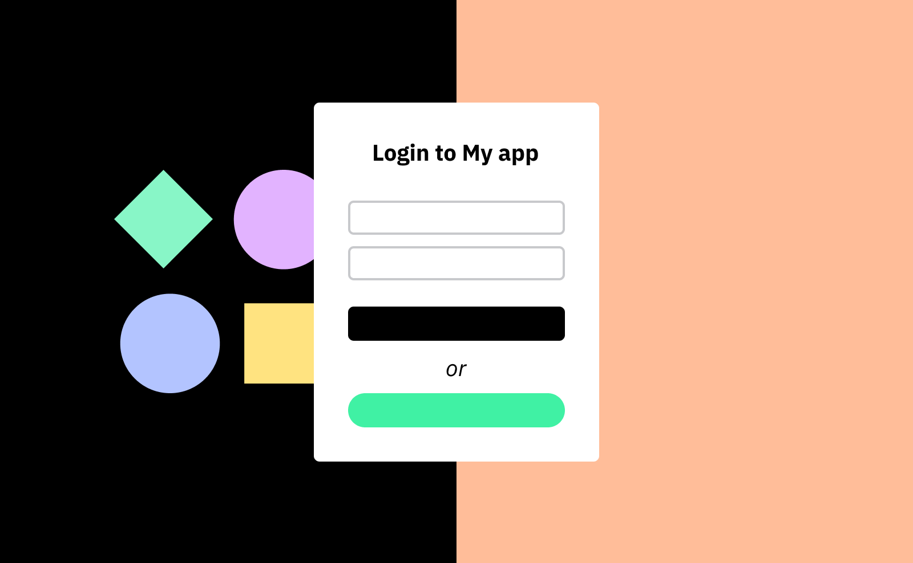
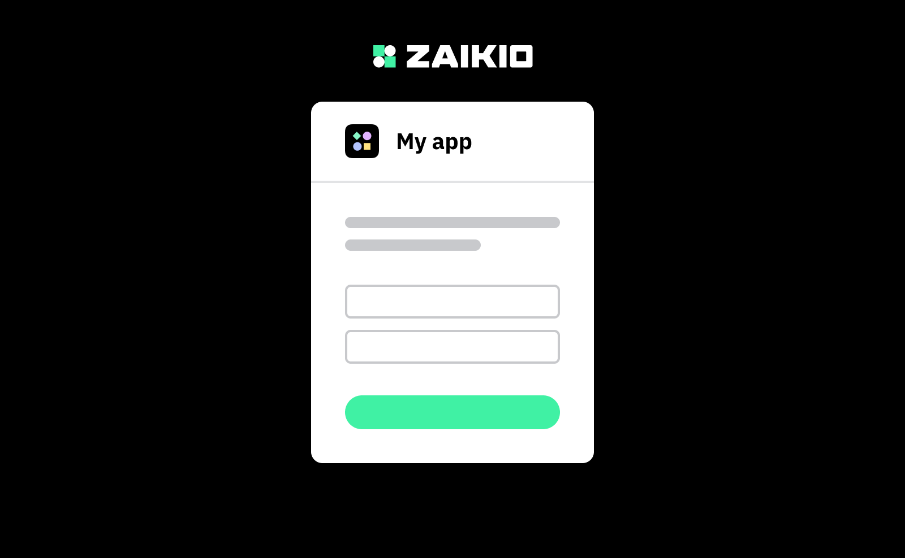
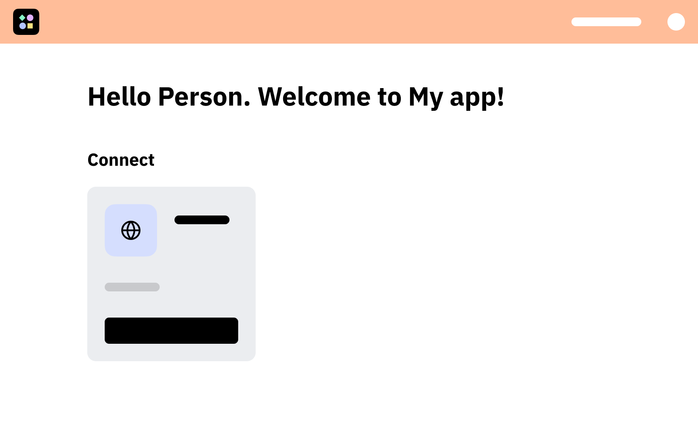
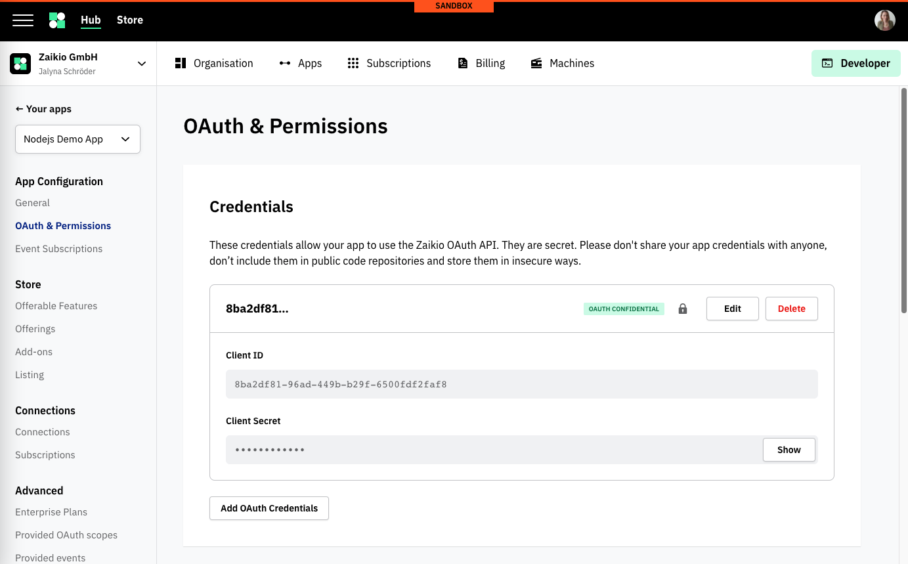
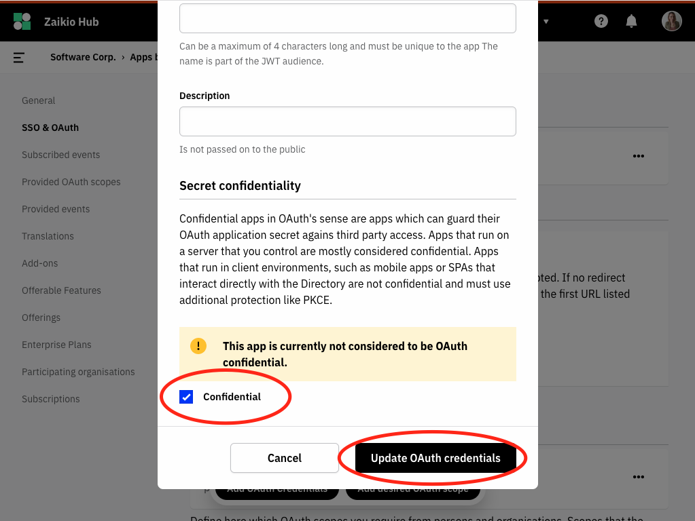
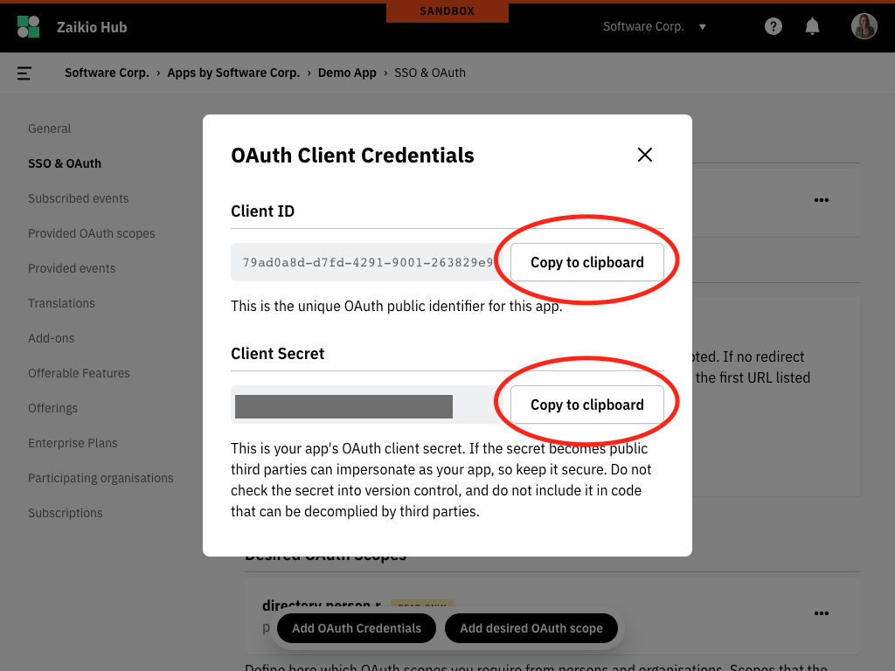
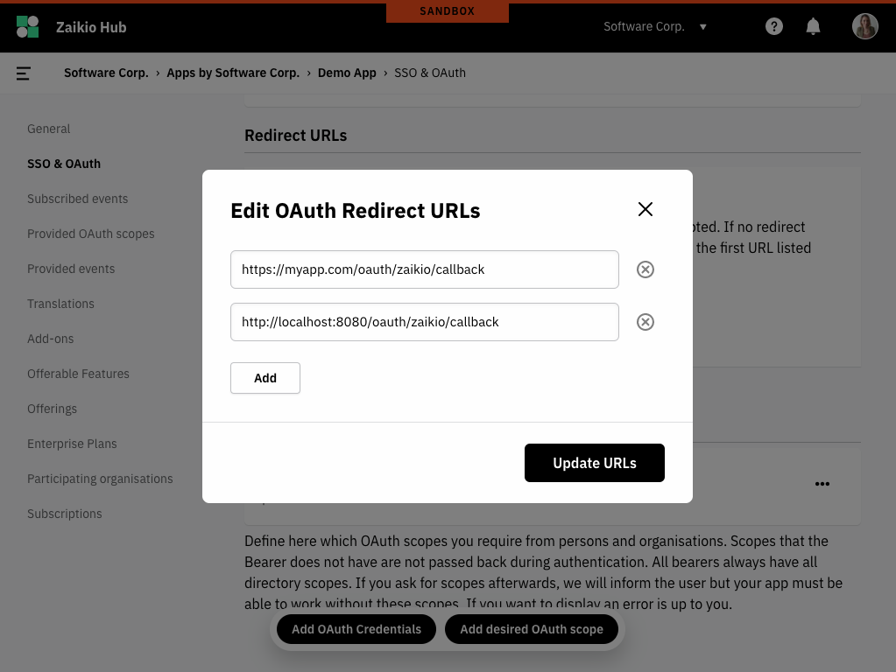

<div class="float-article" style="padding-top: 24px">
  <div class="article-list__item article-list__item--box">
    <div>Node.js</div>
    <h3>Demo app: Redirect Flow & Organisation installation</h3>
    <div class="article-list__item__footer">
      <a href="https://github.com/crispymtn/zai-demo-node" target="_blank" class="link link--github">crispymtn/zai-demo-node</a>
      <a href="https://node-demonstrator.zaikio.com/" target="_blank" class="link link--demo">node-demonstrator.zaikio.com</a>
    </div>
  </div>
</div>

# 2. SSO with Zaikio account

In this chapter you will learn how to integrate Zaikio's Single sign-on in your app.

<div class="u-clearfix"></div>

## Introduction Redirect Flow

There are several types of OAuth Flows. The most used is the [Redirect Flow](/guide/oauth/redirect-flow), it can be used for all devices that have an interactive browser (this applies to all web and mobile apps). The other alternative, which we will not discuss here, is the [Device Flow](/guide/oauth/device-flow). This is used for IoT devices that do not have a browser and/or no way to interact with the browser.

The users of your app will usually follow this flow:

<div class="grid">
<div>
<div class="browser-mockup" data-url="myapp.com">



</div>

When users visit your web application and are not signed in, they are prompted to log in. When they click **Login with Zaikio**, they are *redirected* to Zaikio.

</div>

<div>
<div class="browser-mockup" data-url="hub.zaikio.com/login">



</div>

If users are not yet registered with Zaikio, they have the option of creating a free Zaikio account or signing in with an existing Zaikio account.

</div>

<div>
<div class="browser-mockup" data-url="hub.zaikio.com/grant">


</div>

If users connect with your app for the very first time they need to confirm that connection and grant your app access to the permissions that you are requesting.

</div>

<div>
<div class="browser-mockup" data-url="myapp.com/dashboard">



</div>

Once permissions have been successfully granted and users have logged in to Zaikio, they will be redirected to your website (using the given `redirect_uri`). If the users are already signed in to Zaikio and have been granted access to your application, this redirection will be seamless. You can now use the Zaikio access token to make further requests to the Zaikio APIs.

</div>


</div>

## 2.1. Get Client Credentials for your app

To use Zaikio's OAuth interface (Open Authorization) you need to add your client credentials to your app. This way Zaikio can securely identify your app.

Navigate in [Zaikio Sandbox](https://hub.sandbox.zaikio.com) to your app, and click on **SSO & OAuth**.

You should see a list of OAuth credentials. At the beginning we already create an ID-Secret Pair for you. By default, the credentials are set to non confidential, but we recommend that you always make the authorization confidential. The only exceptions are single page applications that have no backend or clients in the IoT context. You can change this by clicking on **Edit credentials** and then checking the box next to **Confidential**.

Copy the ID and the secret by clicking on **Show credentials** before. It is important that you store these credentials in a safe place where they cannot be easily read and they should not be stored in the source code of your app.

<div class="browser-mockup" data-url="https://hub.sandbox.zaikio.com/organizations/zaikio/apps/demo_nodejs/oauth_credentials">



</div>

<div class="browser-mockup" data-url="https://hub.sandbox.zaikio.com/organizations/zaikio/apps/demo_nodejs/oauth_credentials">



</div>

<div class="browser-mockup" data-url="https://hub.sandbox.zaikio.com/organizations/zaikio/apps/demo_nodejs/oauth_credentials">



</div>


## 2.2. Setup OAuth Client

We recommend that you do not implement OAuth logic yourself, but instead use one of the many [OAuth clients](https://oauth.net/code/). In our Node.js example we will use [simple-oauth2](https://github.com/lelylan/simple-oauth2).

:::: tabs
::: tab Node.js

Using [simple-oauth2](https://github.com/lelylan/simple-oauth2)

```js
const { AuthorizationCode, AccessToken } = require("simple-oauth2");

// Setup OAuth Client
const OAUTH_CLIENT = new AuthorizationCode({
  client: {
    id: process.env.HUB_OAUTH_CLIENT_ID,
    secret: process.env.HUB_OAUTH_CLIENT_SECRET,
  },
  auth: {
    tokenHost: process.env.ZAIKIO_HUB_HOST, // https://hub.sandbox.zaikio.com
    tokenPath: "/oauth/access_token",
  },
});
```
:::
::: tab Ruby

Using [oauth2](https://github.com/oauth-xx/oauth2)

```rb
require "oauth2"

oauth_client = OAuth2::Client.new(
  ENV["HUB_OAUTH_CLIENT_ID"],
  ENV["HUB_OAUTH_CLIENT_SECRET"],
  authorize_url: "oauth/authorize",
  token_url: "oauth/access_token",
  connection_opts: { headers: { "Accept": "application/json" } },
  site: ENV["ZAIKIO_HUB_HOST"] # https://hub.sandbox.zaikio.com
)
```

:::
::::

## 2.3 Setup Redirect URI

After the users have successfully signed in to Zaikio and granted access to your app, they will be redirected back to your app. This webpage must be stored in Zaikio for security reasons. This ensures that you cannot be redirected to external sites if your credentials are used. This URI is called **redirect URI** (sometimes also called callback URI). The redirect URI will likely be something like `https://myapp.com/oauth/zaikio/callback`. You might also add a local URL to start testing the flow on your local environment. You can add multiple URIs:

<div class="browser-mockup" data-url="https://hub.sandbox.zaikio.com/organizations/zaikio/apps/demo_nodejs/oauth_credentials">



</div>

## 2.4 Redirect Users to Zaikio Sign in

When your users click on the *Log in with Zaikio* button, you have to redirect them to Zaikio's **Authorize URL**.

The OAuth client of your choice has a method to generate the URL to Zaikio:

:::: tabs
::: tab Node.js

Using [simple-oauth2](https://github.com/lelylan/simple-oauth2)

```js
// Redirect to Zaikio SSO
res.redirect(
  OAUTH_CLIENT.authorizeURL({
    redirect_uri: process.env.HUB_OAUTH_REDIRECT_URL, // https://myapp.com/oauth/zaikio/callback
    scope: "directory.person.r",
  })
);
```
:::

::: tab Ruby

Using [oauth2](https://github.com/oauth-xx/oauth2)

```rb
redirect_to oauth_client.auth_code.authorize_url(
  redirect_uri: ENV["HUB_OAUTH_REDIRECT_URL"], # https://myapp.com/oauth/zaikio/callback
  scope: "directory.person.r"
)
```
:::
::::

The generated URL will look like this:

```
https://hub.sandbox.zaikio.com/oauth/authorize?client_id={ZAIKIO_CLIENT_ID}&redirect_uri=https://myapp.com/oauth/zaikio/callback&scope=directory.person.r
```


## 2.5 Create Zaikio Access Token

Users are then redirected to Zaikio. After the authorisation is successful and the users are redirected back to your app, the `code` parameter is sent by Zaikio to generate an access token.

:::: tabs
::: tab Node.js

Using [simple-oauth2](https://github.com/lelylan/simple-oauth2)

```js
app.get("/oauth/zaikio/callback", async (req, res) => {
  try {
    // Request access token from Zaikio
    const accessToken = await OAUTH_CLIENT.getToken({
      code: req.query.code
    });
    // Store access token in session
    req.session.zai_access_token = JSON.stringify(accessToken.toJSON());
  } catch (error) {
    console.log("Access Token Error", error.message);
  }
  res.redirect("/");
});
```
:::

::: tab Ruby

Using [oauth2](https://github.com/oauth-xx/oauth2)

```rb
# Request access token from Zaikio
access_token = oauth_client.auth_code.get_token(params[:code])
# Store in session
session[:zaikio_access_token] = JSON.generate(access_token)

redirect_to root_path
```
:::
::::

The generated request to Zaikio's OAuth API will be:

```shell
curl -XPOST -H "Content-type: application/json" -d '{
  client_id: "{ZAIKIO_CLIENT_ID}",
  client_secret: "{ZAIKIO_CLIENT_SECRET}",
  code: "{CODE_PARAM}"
}' 'https://hub.sandbox.zaikio.com/oauth/access_token'
```

When performed the response will look like:

```json
{
  "access_token": "749ceefd1f7909a1773501e0bc57d5b2",
  "refresh_token": "be4ae927cf49466293049c993ad911b2",
  "token_type": "bearer",
  "scope": "directory.person.r",
  "audiences": ["myapp"],
  "expires_in": "2019-12-03T08:57:35.958Z",
  "bearer": {
    "id": "29b276b7-c0fa-4514-a5b1-c0fb4ee40fa7",
    "type": "Person"
  }
}
```

Great! Now you have received a valid `access_token` from the JSON Response, in the next chapter we will use the token to perform requests against the Zaikio API.


<div style="text-align:right;margin-top: 30px;">

[Continue to fetch data about person with the Zaikio Hub API ➞](./use-api.html)

</div>
