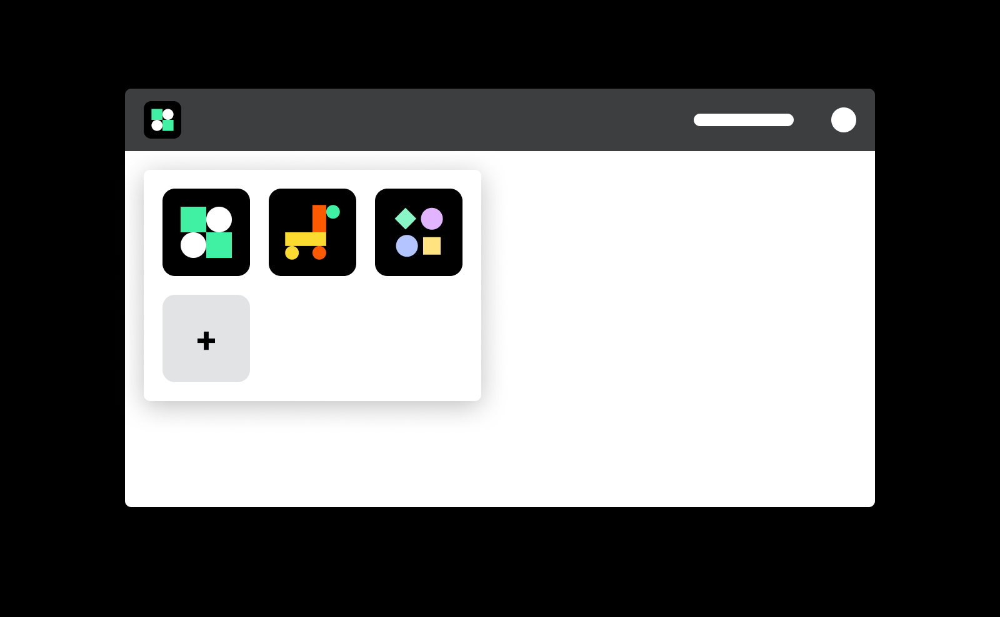

<h1>Guides</h1>

  

    <RouterLink to="/guide/oauth/"></RouterLink>
    <h3>Single Sign-On</h3>
    
Learn how to create a Zaikio account and a Zaikio app. Sign in users with Zaikio. Install an app for an organization.

    
<RouterLink to="/guide/oauth/" class="link">Explore Single Sign-On →</RouterLink>

  

  

    <RouterLink to="/guide/try-api"></RouterLink>
    <h3>Test API requests interactively</h3>
    
Learn how to create a private access token and how to interactively use Zaikio’s API documentations to test.

    
<RouterLink to="/guide/try-api" class="link">Explore Zaikio API requests →</RouterLink>

  

  

    <RouterLink to="/guide/migrate-existing-customers/"></RouterLink>
    <h3>Migrate existing customers</h3>
    
Iteratively migrate your current user database and organisations to Zaikio.

    
<RouterLink to="/guide/migrate-existing-customers/" class="link">Explore migration →</RouterLink>

  

  

    <RouterLink to="/guide/loom/"></RouterLink>
    <h3>Loom event system</h3>
    
Receive events via webhooks or post events to other apps.

    
<RouterLink to="/guide/loom/" class="link">Explore Loom →</RouterLink>

  

  

    <RouterLink to="/guide/provide-api/"></RouterLink>
    <h3>Provide API</h3>
    
Learn how to increase your app's connectivity and offer an API by using Zaikio's JWT.

    
<RouterLink to="/guide/provide-api/" class="link">Explore Provide API Guide →</RouterLink>

  

  

    <RouterLink to="/guide/launchpad/"></RouterLink>
    <h3>Launchpad</h3>
    
Learn how to integrate to your Web-app so that users can switch between apps and organisations.

    
<RouterLink to="/guide/launchpad/" class="link">Explore Launchpad integration →</RouterLink>

  

