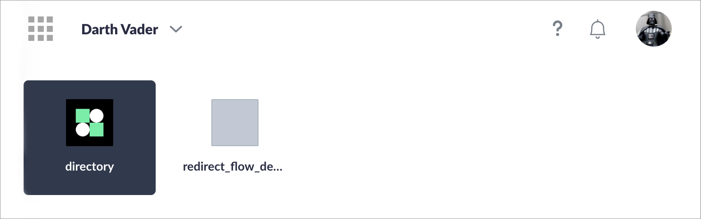

# Launchpad

If you have already set up the Zaikio Single Sign On for your website, we strongly recommend that you integrate our Launchpad so that users can switch between apps and organizations and have a consistent user experience.

## Make your app visible within the Launchpad app

In order for your app to appear among the apps, it is of course first necessary that the person or organization obtains the app (e.g. by successfully completing the Redirect Flow).

Furthermore, the so-called Entry Point URL must be configured in the app settings. This is the URL to which the user is redirected when he or she clicks on the app in the app switcher. We also send two additional parameters. The first is `launchpad=1`, so that you know that the user came via the launchpad, and the `organization_id=abc-def` if an organization was selected.

Entry Point URL `https://example.com/myapp` will result in e.g. `https://example.com/myapp?launchpad=1&organization_id=9c31b099-e28a-42c8-86b4-d4fddd3512c6`

## Integration

- [Integrate Launchpad into non-SPAs](./default-integration.html)
- [Integrate into a single page application](./spa.html)
