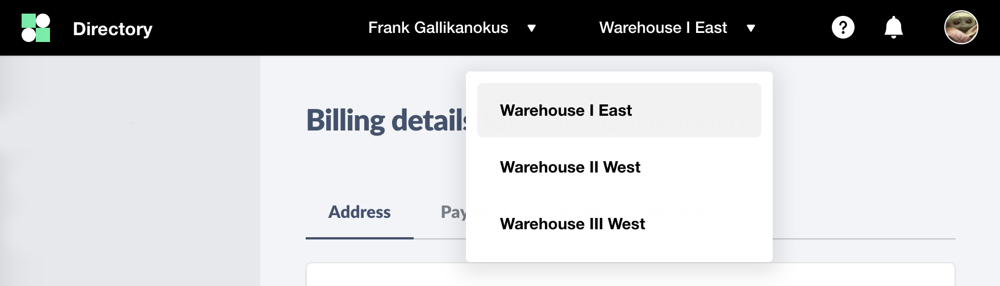

# Custom Switch



You can add a custom switch by proving the `customSwitch` option:

```js
customSwitch: {
  selected: 'abc',
  onChange: id => {
    console.log('CHANGED TO', id)
  },
  options: [
    {
      id: 'abc',
      label: 'Warehouse I East'
    },
    {
      id: 'def',
      label: 'Warehouse II West'
    },
    {
      id: 'ghi',
      label: 'Warehouse III West'
    }
  ]
}
```
