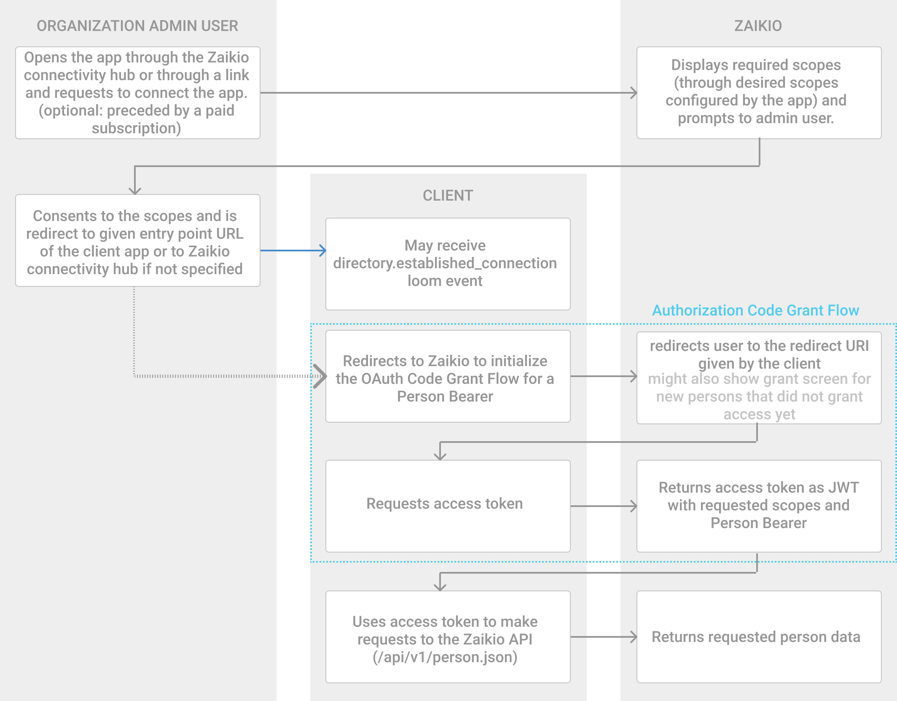
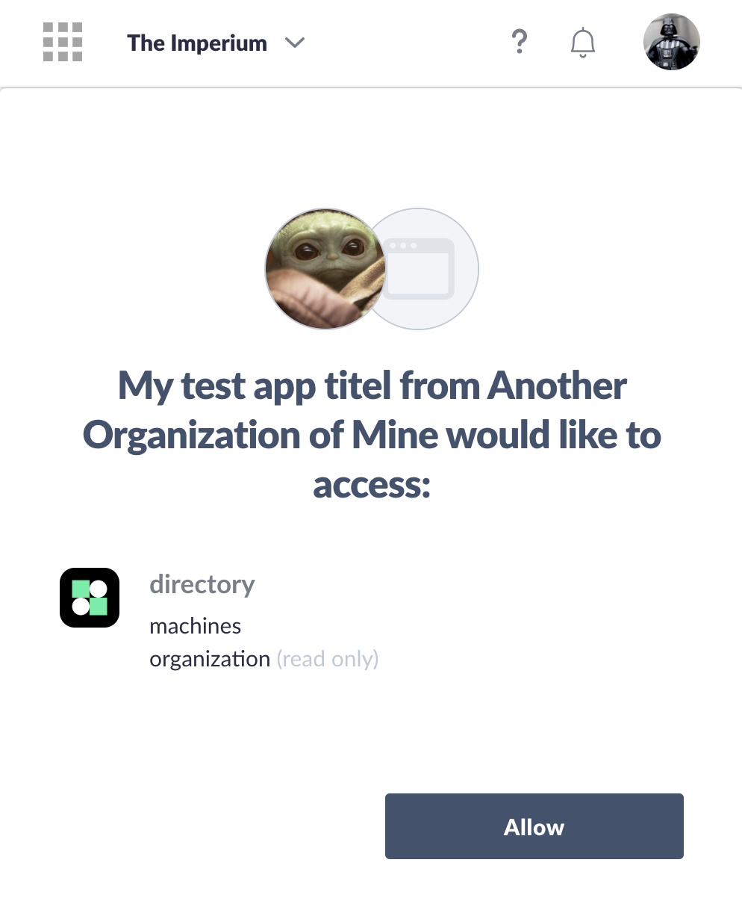

# OAuth

Your app cannot access data through our REST API of a Zaikio organization or person without the organization's admin or person having granted access. Here we show you how the installation and authorization process works in Zaikio. For further details please refer to the [OAuth 2.0 specification](https://tools.ietf.org/html/rfc6749).

## Introduction

There are several ways to connect to an app. Here we will show you one of the standard flows, but we will also discuss other alternatives.

The most important thing to understand is that we distinguish between two types of authorization. The first type is **authorization with a single person** in Zaikio and the second is **authorization to an organization** in Zaikio. Access to an organization can ONLY be granted by administrators of that organization. This means that both ways typically coexist in one app. Most operations are done as an organization but the Single Sign On is usually done with one person.

The default way to install an app in Zaikio is via the Zaikio connectivity hub (if necessary with prior subscription). Usually the administrator of an organization will first install this app and grant it the requested permissions. Then the app can be accessed by all people in the organisation via the [launchpad](/guide/launchpad/) and each person can then, depending on the app, transfer further permissions for their data to the app. It is important to note that the person must never have direct access to an access token of the organization. If they do, they could perform unauthorized actions on behalf of the organization.

The app is allowed to freely design the actions that the individual person may perform in the app. We offer a [list of roles](/api/directory/#/Roles/get_roles) (among others we distinguish between Admin and Member) that can be used to perform authorization within the app. Of course, the app can also create its own roles and access rights and have them distributed by the organization administrator, for example.

An app in Zaikio can not only request permissions for the Zaikio app, but also request data from other apps in Zaikio. We recommend to increase connectivity by offering as many integrations with different apps as possible. In this guide we will mainly focus on connecting to the Zaikio platform.


## Terminology

- **Bearer**: We distinguish between two types of bearers: `Organization` and `Person`. For the default Authentication flow you will most likely use a `Person` bearer.
- **Directory API**: Zaikio's REST API to fetch data from the Bearer.
- **User**: A `Person` that can grant access.
- **Client**: A Zaikio app that wants to access data of an organisation or person.

## Zaikio Default Flow




### Step 1: Setup desired OAuth Scopes




When users install your app, we show them which data their app wants to get access to. These access rights are represented by scopes. The scope decides which API calls the app can perform.

First you must select the scopes to be requested in the Zaikio app under your app in the `SSO & OAuth` tab.

If you type `directory`, our autocomplete will show you the available scopes of the directory API. For now you only need to select the `directory.person.r` and the `directory.organization.r` scope to get started. You can add more scopes later, these will be requested proactively to the user.

For a detailed list of scopes you can refer to the [Directory API Reference](http://localhost:8081/api/directory/).


### Step 2: Setup Entry Point URL

As an Entry Point we describe the website that users see when they want to open your app via the Launchpad or the Zaikio Connectivity Hub. Usually this is the dashboard of your app, which is only visible to authenticated users. The Organization Admin user will also be directed there after they have installed the app for their organization.

We also send two additional parameters. The first is `launchpad=1`, so that you know that the user came via the launchpad, and the `organization_id=abc-def` if an organization was selected. It is also possible that the user has not yet selected an organization.

Entry Point URL `https://example.com/myapp` will result in e.g. `https://example.com/myapp?launchpad=1&organization_id=9c31b099-e28a-42c8-86b4-d4fddd3512c6`

To change the Entry Point URL go to `My Apps` > Your App > `Edit App Details`.


### Step 3: Install your app

In the sandbox you can install your app directly for any organization. All you need is the name of the app and the organization as a slug (URL format):

`https://directory.sandbox.zaikio.com/{org_slug}/connections/{app_name}` e.g. `https://directory.sandbox.zaikio.com/the-imperium/connections/my_app`

There you should now be able to see your app description and a button with `Connect` on it. Again, please note that you can only install an app as administrator of the organization.

After clicking on Connect and accepting the access request, you should be redirected to your Entry Point URL.

Once the app has been published, users can of course find the app directly on the Zaikio platform and do not need to visit the URL.

### Step 4: Get Client Credentials

You need to retrieve an API key and secret key to identify the client during the authorization process.

Go to `My Apps` > Your App > `SSO & OAuth`.

You should see a list of OAuth credentials. At the beginning we already create an ID-Secret Pair for you. By default, the credentials are set to non confidential, but we recommend that you always make the authorization confidential. The only exceptions are single page applications that have no backend or clients in the IoT context. You can change this by clicking on `View` and then on `Make OAuth credentials confidential`.

Copy the ID and the secret by clicking on `View` before. It is important that you store these credentials in a safe place where they cannot be easily read and they should not be stored in the source code (it is best to use environment variables).

### Step 5: Initialize the Redirect Flow

After the administrator has been redirected to your Entry Point URL and other members of the organization could also access the Entry Point URL, you should authorize the users. For this we use the Authorization Code Grant Flow (or Redirect Flow).

There are many [OAuth clients in different programming languages](https://oauth.net/code/) that implement this procedure for you. If you already have your own authentication, it should be easy to add an OAuth2 Client.

Read our detailed [Redirect Flow Guides](./redirect-flow.html).

#### Example with node.js and passportjs

This guide can also be transferred to other clients and programming languages.

1. You have installed and setup a nodejs server e.g. with [express](https://expressjs.com/): `npm install express`
2. You have installed [passport](http://www.passportjs.org/) and [passport-oauth2](http://www.passportjs.org/packages/passport-oauth2/): `npm install passport passport-oauth2`
3. You have configured passport

4. Add OAuth Strategy
```js
passport.use(new OAuth2Strategy({
    authorizationURL: 'https://directory.sandbox.zaikio.com/oauth/authorize',
    tokenURL: 'https://directory.sandbox.zaikio.com/oauth/access_token',
    clientID: ZAIKIO_CLIENT_ID, // your stored credentials: client id
    clientSecret: ZAIKIO_CLIENT_SECRET, // your stored credentials: client secret
    callbackURL: "http://localhost:3000/auth/zaikio/callback", // your callback url
    scope: ['directory.person.r'], // list of scopes
    passReqToCallback: true // receive request data
  },
  function(accessToken, refreshToken, data, _, cb) {
    // Fetch person data e.g. from GET person
    User.findOrCreate({ zaikioId: data.bearer.id }, function (err, user) {
      return cb(err, user);
    });
  }
));
```

5. Add callback endpoint to your app

```js
// Your pages that should only allow authroized access (e.g. your dashboard)
app.get('/dashboard', passport.authenticate('oauth2'));

// The callback URL that the user is redirected when coming from Zaikio
app.get('/auth/zaikio/callback',
  passport.authenticate('oauth2', { failureRedirect: '/login' }),
  function(req, res) {
    // Successful authentication, redirect to dashboard
    res.redirect('/dashboard');
  });
```

6. Add your callback URL as a Redirect URL in Zaikio

Go to `Your Apps` > Your App > `SSO & OAUth` > `Redirect URLs` and click `Change URLs`.
Add your callback URL (e.g. `http://localhost:3000/auth/zaikio/callback`) to your Redirect URLs.


### Step 6: Make authenticated requests

In order to retrieve information about the current user (like email address, name and organisation memberships) you need to query the Directory API at

```
curl --request GET \
  --url 'https://directory.sandbox.zaikio.com/api/v1/person?=' \
  --header 'authorization: Bearer <your API token>'
```

Please note that contrary to the token exchange response, the API only responds with JSON. To authenticate against the API the `Authorization` header must be set to

```
Bearer <your API token>
```

where `<your API token>` must be replaced with the token you obtained in step 5.

### Step 7: Get Organisation Access token

Now you can already make requests on behalf of the person, but in many use cases you want to call APIs and act on behalf of the organization regardless of the access rights an individual person has.

Once the app is installed for the organization, you can use the [Client Credentials Flow](./client-credentials.html). With this you can issue an access token for the organization with only one request. However, this is only possible with confidential OAuth credentials:

```
curl --request POST \
  --url 'https://directory.sandbox.zaikio.com/oauth/access_token?grant_type=client_credentials&scope=Org%2Fb1475f65-236c-58b8-96e1-e1778b43beb7.directory.organization.r%2COrg%2Fb1475f65-236c-58b8-96e1-e1778b43beb7.directory.sites.rw' \
  --header 'authorization: Basic <Basic Auth with your Zaikio Client ID as username and Client Secret as password>'
```

With the access token that is returned here, you can make further requests to the Directory API.

## Refreshing tokens

Every time the Directory hands out an access token, this token is accompanied by a refresh token. The refresh token can be used to obtain a new access token, when the old one has expired. To ensure frequent check-ins with the Directory for security reasons, all access tokens are valid for 60 minutes. After this time it must be exchanged into a new one with the refresh token. If the permissions of the bearer have changed in the interim, this exchange will be denied, thus giving us one method of access control and permission revocation.

Read more about [how to refresh the Access Token](./access-token-refresh.html)

## Other Flows

Currently the following OAuth flows are supported:

- [The Redirect Flow](./redirect-flow.html) - Default for most Apps
- [The Device Flow](./device-flow.html) - For IoT or Mobile Devices
- [Client Credentials Flow](./client-credentials.html) - Machine to Machine communication
- [Delegating Access to Subsystems](./delegate-access.html)

## Further Reading

- [Make your first request to the Zaikio directory API with postman](#coming-soon)
- [Connect with other Zaikio apps and use their API](#coming-soon)
- [Receiving Zaikio events with webhooks](#coming-soon)
