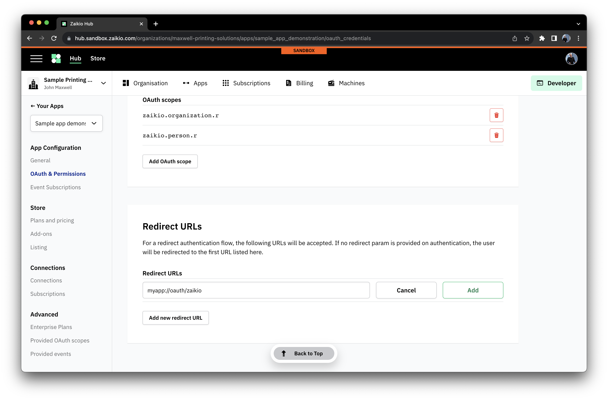
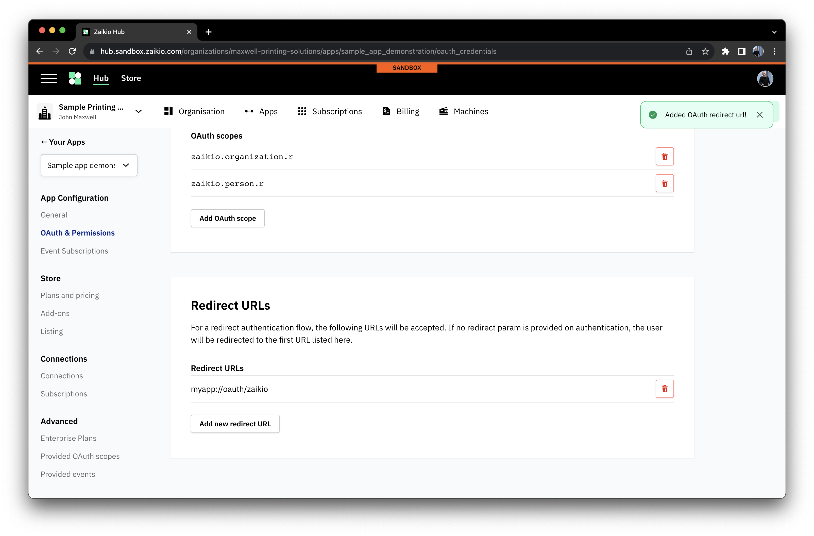
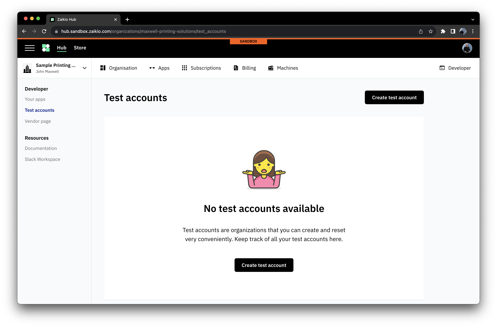
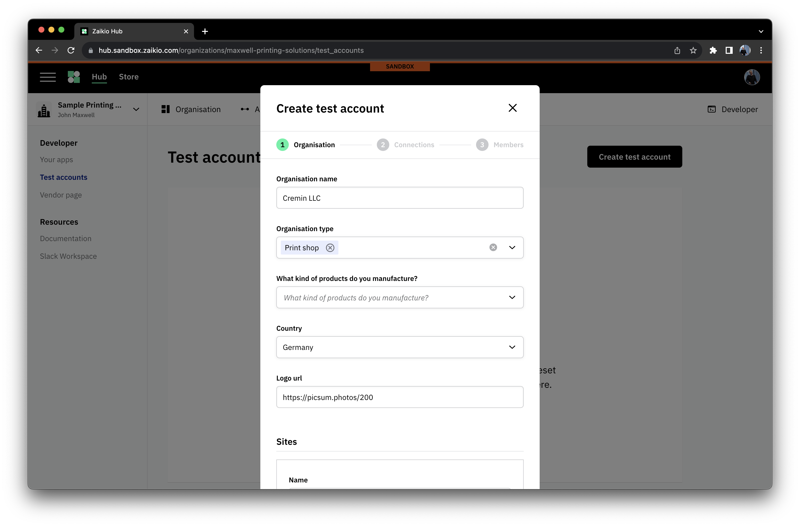
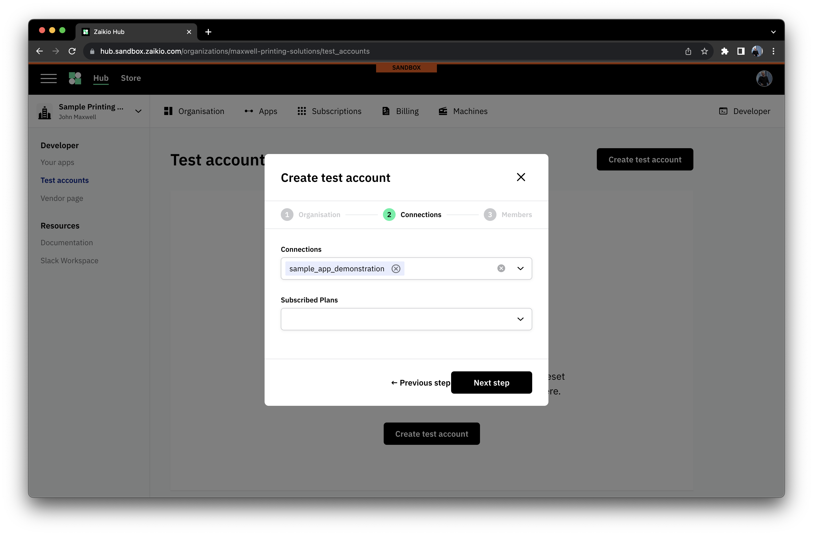
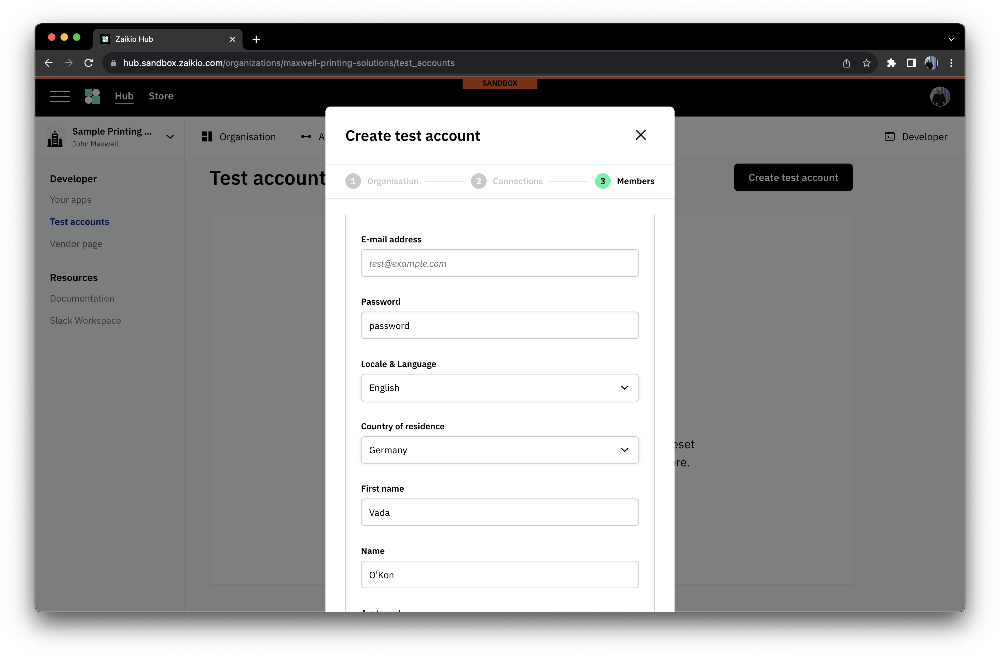
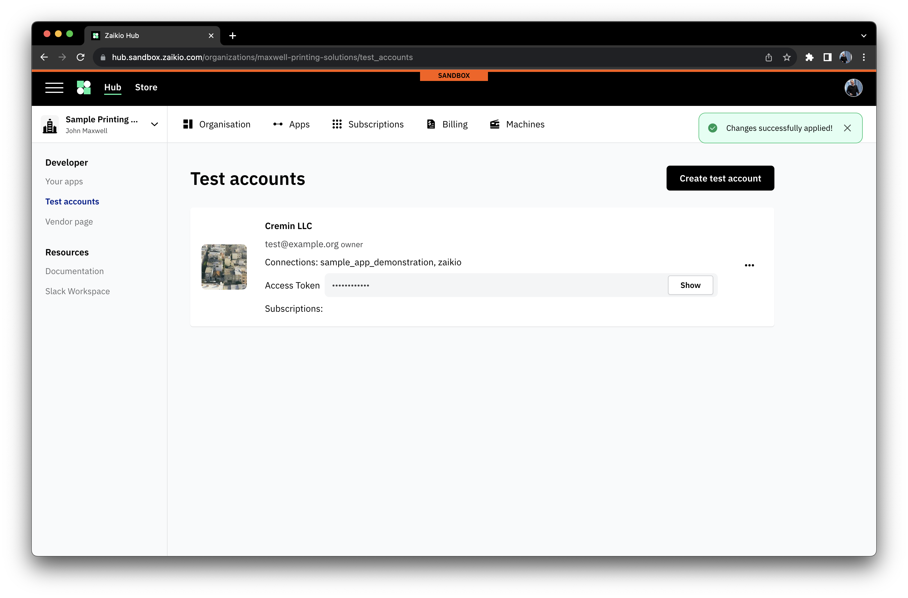

# Integration Guide

[[toc]]

The following guide offers a high-level overview of the key concepts within the platform followed by help in identifying which
approaches might be required to help you solve your integration use case, and how to get help.

## Concepts

### Organisations - everyone needs one

In Zaikio, everything belongs to an Organisation. People are members of one, and they have locations, machines, specialists, and...
_Apps_. This means that to get started doing anything on our platform, you need to create one. The best thing about this is that
it's free.

There are two places you can make an Organisation - depending on whether it's _for real_ or for testing purposes. To make development
easier, we have a complete copy of our production infrastructure running in something that we call the _sandbox_. That allows people
to develop, iterate and make mistakes without worrying about corrupting real data. Then, when you're happy, you can send your setup
to the live platform ready for use. In sandbox, we short-circuit all billing so it's simple to test things out.

### Apps - the core of all integrations

All integrations start with an App. The App is the core of authentication functionality and provide event handling. Regardless of
whether it's a small internal project or a full-blown integration of a mammoth cloud platform, the App forms the heart of it.

We offer two main kinds of apps - `private` or `public`. A `private` App, as the name suggests, is intended for usage in an internal
project, or possibly as a test project where a small number of testers are manually invited to participate. Private Apps are never
able to be listed on our [App Store](https://store.zaikio.com), nor can they support end-user signup. Otherwise they are fully functional.

Public Apps are designed for the majority of use-cases, especially where integrating an existing product such as an MIS or suite of
machines, or when building green field offerings for many customers.

### OAuth - asking permission, building trust with data

All data in the Zaikio platform lives within an Organisation's secure Workspace. This is protected using a comprehensive, fine-grained
permissions model, and consumed through industry-standard OAuth 2.0 authentication flows. When you have created your application, you then
use OAuth's standards-based flows to ask for access to an Organisation's data. Our platform handles these requests for you with
minimal work on your side, as long as you use off-the-shelf tooling that is available in almost every known programming language, and
even No-Code platforms.

When you configure your application, you name `scopes` that represent the kinds of data that you wish to access. These include things
such as `zaikio.jobs.r` to read `Job` data, or `zaikio.estimates.rw` to read and write `Estimate` data for a `Job`.

### Confidential vs Public - secret handling for OAuth

Regardless of the _flow_ type of the OAuth integration (how the App gets permission to use data), Apps also have to be classified into
two camps - `confidential` for those which are capable of securely storing and using a client secret, or `public` for those that
are not.

It's worth stating here that for an OAuth App (as all Zaikio platform Apps are), the _client secret_ is essentially a skeleton key that
can give access to any and all data the app can read. It is never worth the cost of overestimating the security of a solution. Some
types of deployment, such as managed single-tenant deployments of a shared codebase, whilst at first glance might appear safe and
`confidential`, should not be. A breach in a single customer's deployment would leak the secret that would give access to all of the
App's data, and that cannot be risked. Our [integration guide table](#integration-types) gives our suggested classifications for
different integration types.

Fortunately, a `public` App is not difficult to handle - it requires a tweak to the authorization process called PKCE, which is part
of the OAuth 2.0 standard and handled by most libraries seamlessly. If you develop with Node JS, then you might well be using
[Passport](https://www.passportjs.org/) already, in which case this is as simple as installing our passport plugin =
[zaikio/passport-zaikio](https://github.com/zaikio/passport-zaikio).

### Native or Mobile apps - handling redirects

Creating a native application that can handle the OAuth redirect flow requires special case handling of the redirect return request.
Our model allows you to achieve seamless integrations using the following steps:

1. Register a URL-scheme handler for your application with the host operating system. This varies based on the OS platform, but common
   ones are linked below:
   - Apple [https://developer.apple.com/documentation/xcode/defining-a-custom-url-scheme-for-your-app](https://developer.apple.com/documentation/xcode/defining-a-custom-url-scheme-for-your-app)
   - Windows [https://learn.microsoft.com/en-us/windows/win32/search/-search-3x-wds-ph-install-registration](https://learn.microsoft.com/en-us/windows/win32/search/-search-3x-wds-ph-install-registration)
   - Android [https://developer.android.com/training/app-links/deep-linking](https://developer.android.com/training/app-links/deep-linking)
2. Set your application to handle a well-known redirect URL, such as `myapp://auth/zaikio`
3. Provide this URL to the authorized callback URLs in your App "OAuth & Permissions" settings as follows

### Events - finding out when things happened

OAuth gives you the authentication and authorisation tools to access the APIs provided by the Zaikio platform (and by other
integrated Apps!) but most applications will want to be able to take actions when data changes rather than taking the cumbersome steps
of continually asking _if_ something has changed.

When you setup your application you can request to receive this notifications for as many `topics` as you desire. These can be broad
concepts such as `zaikio.job_added` - sent when a `Job` is added to the platform, or fine-grained ones such as
`zaikio.job_state_is_ready_for_production` - sent when a `Job` is sufficiently progressed to be able to go to production.

We operate two key systems for receiving these notifications, or `events`. The first is an extremely common pattern with all web-based
platforms of offering a kind of callback web request known as a `webhook`. This is normally the best option, offering a simple approach
to receiving events (any web-server connected to the internet) and to scaling consuming them (webhooks are stateless, and so receivers
can be horizontally-scaled). Unfortunately, some deployment topologies do not support inbound connections from the internet. To solve
these common but complex use-cases, we also offer a `websocket` method for consuming events. This flips the model around, and instead
of our platform opening a connection to the App, the App will connect to our platform and then receive a stream of events in realtime.

Like with OAuth, both approaches use industry-standard technologies and have libraries that support developers in almost all languages.
The table below offers links to the relevant approach for different kinds of integration project.

### Test Accounts - simple contexts for development

Within the Developer area of your Organisation, you'll find the option to be able to set up Test Accounts. These are designed to help
you simply create contexts for testing your application, and can be reset to a blank state with a couple of clicks. You can
pre-configure their connections to applications, allowing complex setups to be simply provisioned and reset.

To setup a Test Account, the following steps are all you need.

## Identifying your integration

The following table offers an overview of the core types of integration with the Zaikio platform. To use, simply pick the description
of the project you are working on, and follow the links to relevant documentation for the main concepts required to setup your App.

### Integration Types

| Description | Type of App | OAuth type | OAuth flow | Event Handling |
| --- | --- | --- | --- | --- |
| Internal Project - no user interface | [Private](./private-apps.html) | confidential | [Client Credentials](/guide/oauth/client-credentials.html) | [webhooks](./events-webhooks.html) or [websockets](./events-websockets.html) |
| Internal Project - with user interface | [Private](./private-apps.html) | confidential | [Redirect Flow](/guide/oauth/redirect-flow.html) | [webhooks](./events-webhooks.html) or [websockets](./events-websockets.html) |
| Native Application - Windows/Mac/iOS/Android | [Public](./public-apps.html) | public | [Redirect Flow with PKCE](/guide/oauth/redirect-flow.html#pkce) | [websockets](./events-websockets.html) |
| On-Premise server-based App | [Public](./public-apps.html) | public | [Redirect Flow with PKCE](/guide/oauth/redirect-flow.html#pkce) | [websockets](./events-websockets.html) |
| One-install-per-client hosted App | [Public](./public-apps.html) | public | [Redirect Flow with PKCE](/guide/oauth/redirect-flow.html#pkce) | [webhooks](./events-webhooks.html) or [websockets](./events-websockets.html) |
| Multi-tenant App | [Public](./public-apps.html) | confidential | [Redirect Flow](/guide/oauth/redirect-flow.html) | [webhooks](./events-websockets.html) |
| Device | [Public](./public-apps.html) | public | [Device Flow](/guide/oauth/device-flow.html) | [websockets](./events-websockets.html) |

## Exploring the Data Model

Once you have created your App and have learned about how to setup OAuth and your Event handling, you can get started! If you're a
little impatient and just want to explore, you _could_ short-circuit some of this and do it later. There's a guide on how to use
a _Personal Access Token_ to [explore our API available here](./exploring-the-api.html) and that will get you setup and sending
requests in no time.

Introductory Guides are [available here](/integration/data-model-guide/) or
you can find detailed conceptual information about our core platform [here](/guide/). Conceptual information - for example about how the data platform
models Jobs [here in the documentation](/api/data_platform/guides/) can be found
in the individual API package guides Apps that make up our platform. These are all
linked on the sidebar on the left, and it's worth noting that everything we do
runs on top of the platform in the same way that your own Apps will do - we are
confident in it _because we use it ourselves_.

## Getting Help

Help. It's a small word but it makes all the difference. We know that sometimes you just need to check on something, and we pride
ourselves on being available and responsive. The best place to get help is to join our
[Zaikio Community slack space](https://join.slack.com/t/zaikio-community/shared_invite/zt-1zubd0xar-bxO0MjznmwOkCfVANN2j1g) where
fellow members of our community and our own team hang out ready to assist. We'd really recommend asking questions in our new, public
channel dedicated to Zaikio platform support _#zaikio-data-platform_. We fully know that sometimes a question feels a bit obvious,
or maybe touches on some more sensitive ideas - that's fine, just send a message on the channel and one of our team will engage with
you privately.

We'll gather all of the best questions up and answer them as part of our Dev Deep Dive series on LinkedIn live, and there _might_
sometimes be some swag for contributions we feel are particularly awesome!
