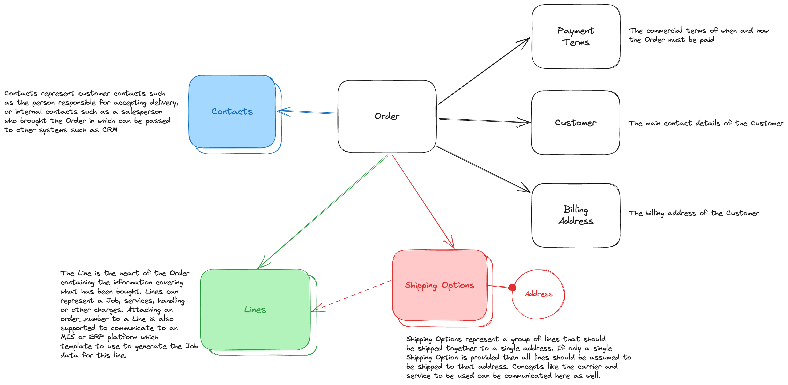

# Data Model Guide: Order

[[toc]]

## Introduction

The Order represents the commercial arrangement between a printer and their customer to produce a Job.
Unlike in some platforms, Zaikio focuses on the Job as the core of the data model, which means that
Order information is optional rather than the top level concept. We would encourage applications to
submit the Order data that is available as this provides essential context for other processes such
as production scheduling.

## The data model



## Getting started

::: tip Documentation format
To make commenting on the payload simple, we're providing these examples as JS code samples. This allows
things such as identifiers to be dynamically generated as well as comments being allowed. We are using `log`
as a helper function here, which is implemented as follows.

```js
const log = (data) => console.log(JSON.stringify(data, undefined, 2));
```

At simplest you can copy the above into a file with your chosen payload and then just run the file using:
`node my-file.js`
:::

Like many of our topic based endpoints, it's possible to create the entire payload of an Order in a single
API call using our `POST /api/v1/orders` endpoint.

## Creating an Order

```js
log({
  // The state of the order, see State Transition for details
  state: "draft",
  // The currency of the order
  currency: "EUR",
  // References for this order, these should ideally be human readable
  references: ["Keyline/ORDER1"],
  // The net total of the value of this transaction
  net_total: 1000,
  // The gross total of the value of this transaction
  gross_total: 1200,
  // The billing address
  address: {
    kind: "billing",
    addressee: "J. Goodmountain",
    street: "Emmerich-Josef-Straße",
    number: "1A",
    town: "Mainz",
    zip_code: "55116",
    country_code: "DE",
    state: "Rheinland-Pfalz"
  },
  shipping_options: [{
    address: {
      kind: "billing",
      addressee: "J. Goodmountain",
      street: "Emmerich-Josef-Straße",
      number: "1A",
      town: "Mainz",
      zip_code: "55116",
      country_code: "DE",
      state: "Rheinland-Pfalz"
    },
    carrier: "dhl"
  }],
  customer: {
    name: "Johnny Goodmountain",
    references: ["Keyline/Customer/JGoodmountain"]
  },
  payment_terms: {
    means_of_payment: "credit_card",
    means_of_payment_hint: "4242",
    mode: "prepaid"
  },
  line_items: [
    {
      kind: "product",
      job_id: "466b0a58-e9d1-4a20-8387-016eeeb8a7ec",
      quantity: 100,
      unit: "piece",
      description: "Some Printing",
      net_price: 10,
      net_total_price: 1000,
      gross_price: 12,
      gross_total_price: 1200,
      taxes: 200,
      tax_rate: "0.2",
      references: ["App/Line/foo"]
    }
  ],
  contacts: [
    {
      role: "customer_contact",
      display_name: "Johnny Goodmountain",
      email: "jgoodmountain@example.org"
    }
  ]
})
```

## Using an `order_number` to communicate a SKU or template

This is simple if you remove the `job_id` from the Line and instead provide the
field `order_number`.

There are huge disadvantages to using this system instead of providing complete
Job data, as it requires non-platform co-ordination between the system taking
the Order and whatever backend MIS/ERP systems are ingesting it and populating
the Job information.

```js
log({
  kind: "product",
  order_number: "some-sku-representing-the-thing-to-produce",
  quantity: 100,
  unit: "piece",
  description: "Some Printing",
  net_price: 10,
  net_total_price: 1000,
  gross_price: 12,
  gross_total_price: 1200,
  taxes: 200,
  tax_rate: "0.2",
  references: ["App/Line/foo"]
})
```

## Creating an Order shipped to multiple destinations

```js
const crypto = require("crypto");
const shipping_option_id1 = crypto.generateUUID();
const shipping_option_id2 = crypto.generateUUID();

log({
  state: "draft",
  currency: "EUR",
  references: ["Keyline/ORDER1"],
  net_total: 1000,
  gross_total: 1200,
  address: {
    kind: "billing",
    addressee: "J. Goodmountain",
    street: "Emmerich-Josef-Straße",
    number: "1A",
    town: "Mainz",
    zip_code: "55116",
    country_code: "DE",
    state: "Rheinland-Pfalz"
  },
  shipping_options: [{
    id: shipping_option_id1,
    address: {
      kind: "shipping",
      addressee: "J. Goodmountain",
      street: "Emmerich-Josef-Straße",
      number: "1A",
      town: "Mainz",
      zip_code: "55116",
      country_code: "DE",
      state: "Rheinland-Pfalz"
    },
    carrier: "dhl"
  }, {
    id: shipping_option_id2,
    address: {
      kind: "shipping",
      addressee: "J. Bloggs",
      street: "Main St.",
      number: "1A",
      town: "Beverly Hills",
      zip_code: "90210",
      country_code: "US",
      state: "CA"
    },
    carrier: "dhl"
  }],
  customer: {
    name: "Johnny Goodmountain",
    references: ["Keyline/Customer/JGoodmountain"]
  },
  payment_terms: {
    means_of_payment: "credit_card",
    means_of_payment_hint: "4242",
    mode: "prepaid"
  },
  line_items: [
    {
      kind: "product",
      job_id: "466b0a58-e9d1-4a20-8387-016eeeb8a7ec",
      shipping_option_id: shipping_option_id1,
      quantity: 100,
      unit: "piece",
      description: "Some Printing",
      net_price: 10,
      net_total_price: 1000,
      gross_price: 12,
      gross_total_price: 1200,
      taxes: 200,
      tax_rate: "0.2",
      references: ["App/Line/foo"]
    }, {
      kind: "product",
      job_id: "466b0a58-e9d1-4a20-8387-016eeeb8a7ec",
      shipping_option_id: shipping_option_id2,
      quantity: 100,
      unit: "piece",
      description: "Some Printing",
      net_price: 10,
      net_total_price: 1000,
      gross_price: 12,
      gross_total_price: 1200,
      taxes: 200,
      tax_rate: "0.2",
      references: ["App/Line/foo"]
    }
  ],
  contacts: [
    {
      role: "customer_contact",
      display_name: "Johnny Goodmountain",
      email: "jgoodmountain@example.org"
    }
  ]
})
```
