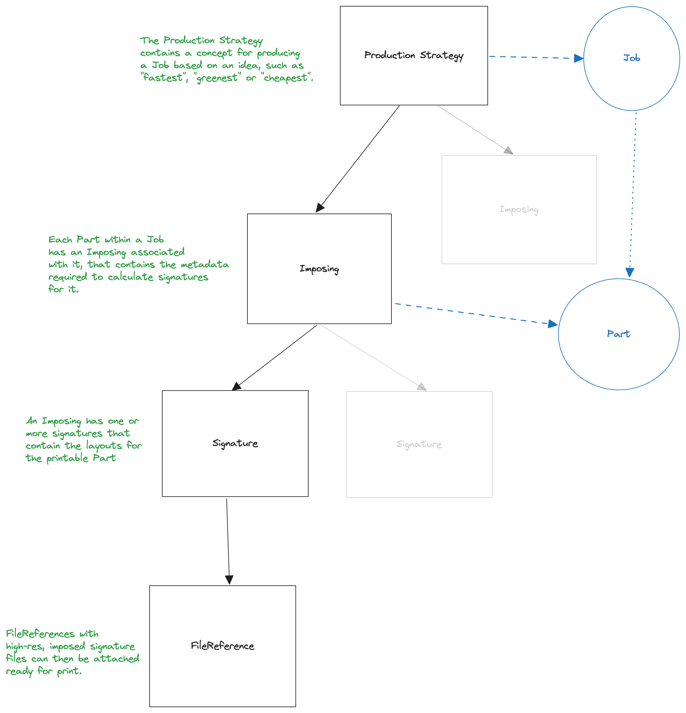
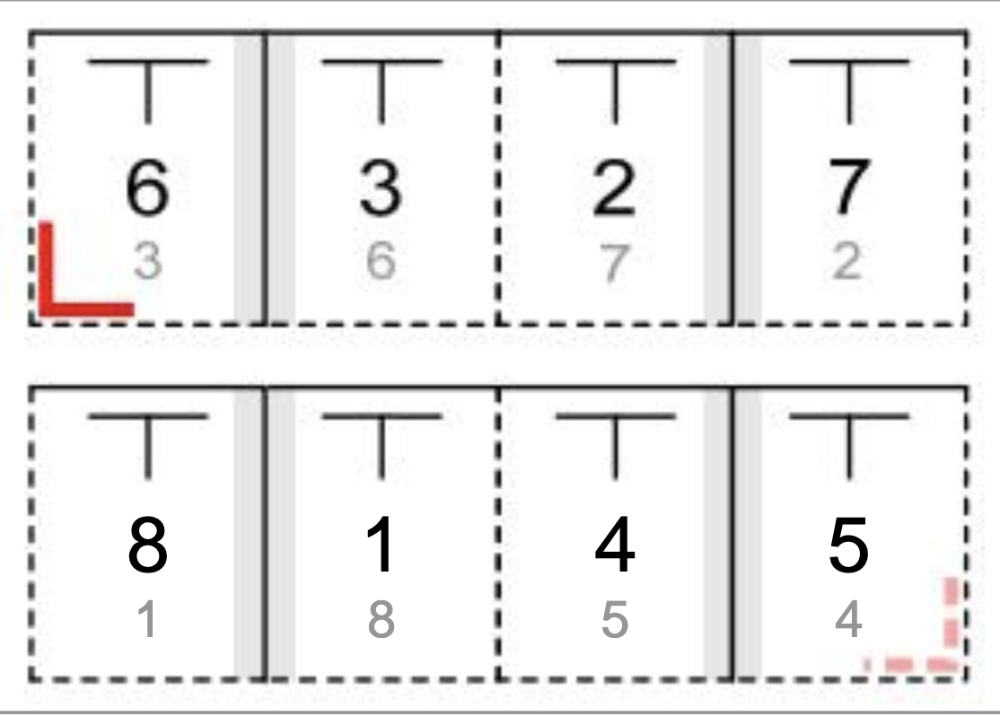

# Data Model Guide: Production Strategies

[[toc]]

## Introduction

Turning a Job into something printable requires a plan on how to produce it. This plan has
two halves - a Production Strategy of how to turn the raw print data and finishing information
into production ready concepts, and a Process Network of what to produce.

The Production Strategy can be used by processes such as Estimation to understand what should
be quoted on, and turned into print-ready signatures.

It's likely that more than one application will be involved in the creation of a full Production
Strategy - for example an MIS to set up the parameters, and then an Imposing application to
produce signatures based on the requirements.

## Data Model



### States

| Name | Description |
| --- | --- |
| draft | The default state |
| ready_for_imposing | All imposing parameters have been added, imposing can begin |
| imposed | Imposing has been completed |
| approved | An optional state indicating this strategy has been selected for production |
| outdated | A change in the linked Job has rendered this strategy invalid |
| canceled | This strategy has been rejected and is now not used |
| exception | Something has gone wrong in specification or imposing and the strategy has errored |

## Creating a Strategy

`POST /api/v1/jobs/:id/production_strategies`

```json
{
  "production_strategy": {
    // The kind of the Production Strategy
    "kind": "cheapest",
    // The current state, can be omitted as draft is the default
    "state": "draft",
    "imposings": [
      {
        // The ID of the Part within the Job
        "part_id": "90e2a19b-47d0-4b13-8e5c-c110ebda6961",
        /*
        * Hint on how to use the substrate, one of:
        * maximize_substrate_utilization
        * long_side_follows_grain
        * short_side_follows_grain
        */
        "orientation": "maximize_substrate_utilization",
        // what kind of signature mixing is allowed within this imposing:
        // single, multiple or gang
        "signature_mixing": "single",
        // The print technology requested to be used
        "requested_technique": "digital",
        // The selected print technology, often picked by the imposer
        "technique": "digital",
        // The requested paper handling mode, one of:
        // perfecting, turn_or_tumble, turn or tumble
        "requested_mode": "perfecting",
        // The actual selected paper handling mode, often picked by the imposer
        "mode": "perfecting",
        // Any pre-selected folding schemas that can be picked from
        "allowed_folding_schemas": [{
          "catalog": "JDF",
          "name": "F8-1"
        }, {
          "catalog": "JDF",
          "name": "F16-1"
        }],
        // Requested Machine ID of a specific machine to ideally print on, if present should
        // be honoured for Imposing
        "requested_machine_id": "b8a77b3d-4800-4446-8ade-37d0957ba8dc",
        // Actual Machine ID of the selected machine to print on based on the Imposing
        "machine_id": "b8a77b3d-4800-4446-8ade-37d0957ba8dc",
        // Substrate properties to be used
        "substrate": {
          "name": "Magno Silk",
          "dimensions": {
            "width": "210.0",
            "height": "280.0"
          },
          "precut_dimensions": {
            "width": "300.0",
            "height": "680.0"
          },
          "dimensions_unit": "mm",
          "coated": {
            "front": true,
            "back": false
          }
        }
      }
    }
  }
}
```

## Providing signatures

Once a Production Strategy has been marked as `ready_for_imposing`, an imposing app can
process the production strategy in conjunction with the Job data to come up with Signatures.
The process of doing this is beyond this document, but essentially the layout of the Parts in
the Job should be overlaid onto sheets for printing, and then recorded back in a Signature.

Given a Part which has 8 100x100mm pages, an input layout would look something like the following.

```json
{
  "layout": {
    "format": "box",
    "version": 1,
    "unit": "mm",
    "contents": [{
        "kind": "page",
        "sides": "two",
        "front": { "page_number": 1 },
        "back": { "page_number": 2 },
        "dimensions": { "width": 100, "height": 100 },
        "bleeds": { "left": 0, "top": 0, "right": 0, "bottom": 0 },
        "print_free_margins": { "left": 0, "top": 0, "right": 0, "bottom": 0 },
        "position": { "x": 0, "y": 0 },
        "children": []
      },
      {
        "kind": "page",
        "sides": "two",
        "front": { "page_number": 3 },
        "back": { "page_number": 4 },
        "dimensions": { "width": 100, "height": 100 },
        "bleeds": { "left": 0, "top": 0, "right": 0, "bottom": 0 },
        "print_free_margins": { "left": 0, "top": 0, "right": 0, "bottom": 0 },
        "position": { "x": 0, "y": 0 },
        "children": []
      },
      {
        "kind": "page",
        "sides": "two",
        "front": { "page_number": 5 },
        "back": { "page_number": 6 },
        "dimensions": { "width": 100, "height": 100 },
        "bleeds": { "left": 0, "top": 0, "right": 0, "bottom": 0 },
        "print_free_margins": { "left": 0, "top": 0, "right": 0, "bottom": 0 },
        "position": { "x": 0, "y": 0 },
        "children": []
      },
      {
        "kind": "page",
        "sides": "two",
        "front": { "page_number": 7 },
        "back": { "page_number": 8 },
        "dimensions": { "width": 100, "height": 100 },
        "bleeds": { "left": 0, "top": 0, "right": 0, "bottom": 0 },
        "print_free_margins": { "left": 0, "top": 0, "right": 0, "bottom": 0 },
        "position": { "x": 0, "y": 0 },
        "children": []
    }]
  }
}
```

Then, once imposed into a foldable sheet, the resulting signature layout would be the following,
given selection of the JDF-F8-1 folding scheme.

To help visualise, this scheme looks as follows:



`POST /api/v1/imposings/:id/signatures`

```json
{
  "signature": {
    // The kind of the signature
    "kind": "fold",
    // The folding scheme used, if any, required if kind is fold
    "folding_schema": { "catalog": "JDF", "name": "F8-1" },
    // The pages contained within this signature, required if kind is spread or fold
    "pages": [1, 2, 3, 4, 5, 6, 7, 8],
    // The layout is the same as within the Job section and more information on the fields
    // is available there
    "layout": {
      "format": "box",
      "version": 1,
      "unit": "mm",
      "contents": [{
        "kind": "fold",
        "dimensions": { "width": "400", "height": "100" },
        "bleeds": { "left": 0, "top": 0, "right": 0, "bottom": 0 },
        "print_free_margins": { "left": 0, "top": 0, "right": 0, "bottom": 0 },
        "position": { "x": 0, "y": 0 },
        "children": [
          // The left panel of the imposed signature
          {
            "kind": "page",
            "sides": "two",
            "front": { "page_number": 6 },
            "back": { "page_number": 5 },
            "dimensions": { "width": 100, "height": 100 },
            "position": { "x": 0, "y": 0 },
            "children": []
          },
          // The left-centre panel of the imposed signature
          {
            "kind": "page",
            "sides": "two",
            "front": { "page_number": 3 },
            "back": { "page_number": 4 },
            "dimensions": { "width": 100, "height": 100 },
            "position": { "x": 100, "y": 0 },
            "children": []
          },
          // The right-centre panel of the imposed signature
          {
            "kind": "page",
            "sides": "two",
            "front": { "page_number": 2 },
            "back": { "page_number": 1 },
            "dimensions": { "width": 100, "height": 100 },
            "position": { "x": 200, "y": 0 },
            "children": []
          },
          // The right panel of the imposed signature
          {
            "kind": "page",
            "sides": "two",
            "front": { "page_number": 7 },
            "back": { "page_number": 8 },
            "dimensions": { "width": 100, "height": 100 },
            "position": { "x": 300, "y": 0 },
            "children": []
          },
        ]
      }]
    }
  }
}
```

## State Changes

Once all signatures have been added, then the state of the Production Strategy should be set to
`imposed`, or if there were problems in calculating signatures then the strategy can be errored out.

State changes must be done by patching a state change event to the correct endpoint:

`PATCH /api/v1/production_strategies/:id/state`

```json
{
  "production_strategy": {
    "event": "foo"
  }
}
```

| Input states | Event | Output state |
| --- | --- | --- |
| `draft` | `can_be_imposed` | `ready_for_imposing` |
| `ready_for_imposing` | `imposing_complete` | `imposed` |
| `imposed` | `approve` | `approved` |
| `draft`, `ready_for_imposing`, `imposed`, `outdated`, `exception` | `cancel` | `canceled` |
| `draft`, `ready_for_imposing`, `imposed`, `canceled`, `outdated`, `exception` | `outdated` | `outdated` |
| `draft`, `ready_for_imposing`, `imposed`, `canceled`, `outdated` | `error` | `exception` |
| `exception` | `reset` | `draft` |

## Deciding when to act

ProductionStrategy lifecycle events are emitted through the event system, and can be relied upon for an instruction
of when to act. We would always recommend coding defensively, but semantically it is correct to impose a ProductionStrategy
when the **zaikio.production_strategy_state_is_ready_for_imposing** event is seen.

## Adding print ready files

To retrieve all of the file references for a given Imposing, simply query the API for the file references attached
to a Part. `GET /api/v1/parts/:part_id/file_references` is the route required, and will return all of the FileReferences
for that Part. Given the list, one should:

- filter it based on `file_reference.kind == "artwork"`
- load the files by URL
- attribute the correct part of the file to the correct segment of the signature. It is simple to identify the correct
  file_reference to use for a given page of a layout.
    - if the page in the layout has a `reference` property, that will point to the ID of the file reference to interpret
      the `page_number` properties within
    - if the page in the layout has no `reference` property, then simply select the first file reference for the Part.

It's simple to then add print ready files to a Signature. Simply follow the instructions [from our Files data model guide](/integration/data-model-guide/files.html#signature).
Files will need to be uploaded somewhere, and then referenced - either in Zaikio Vault, or by URL.
