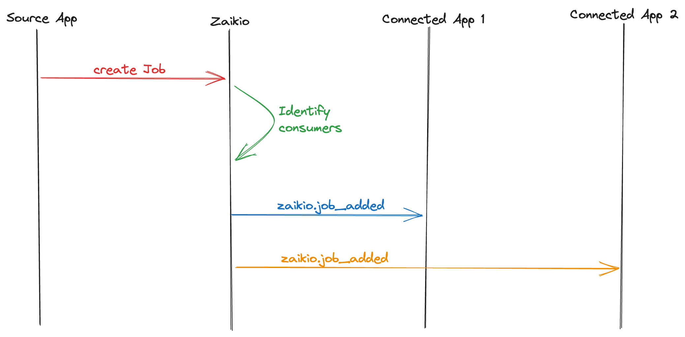
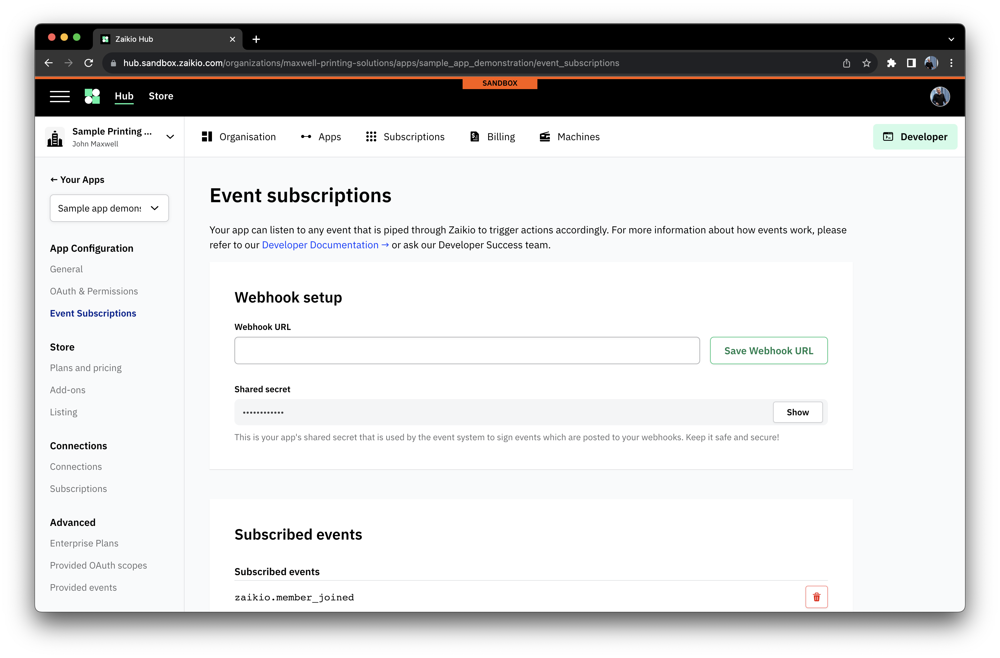
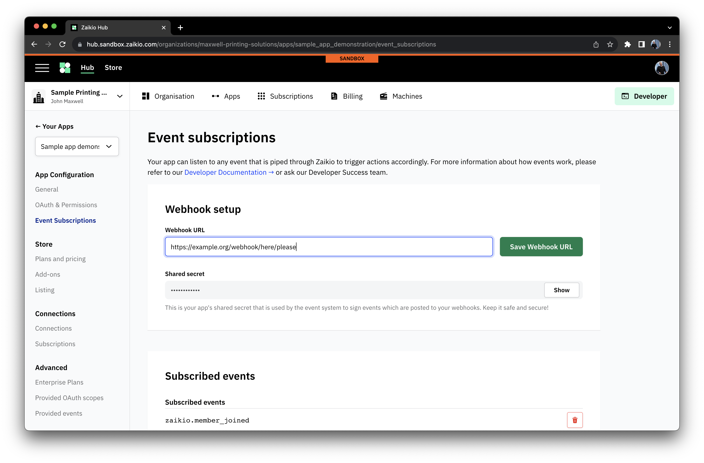
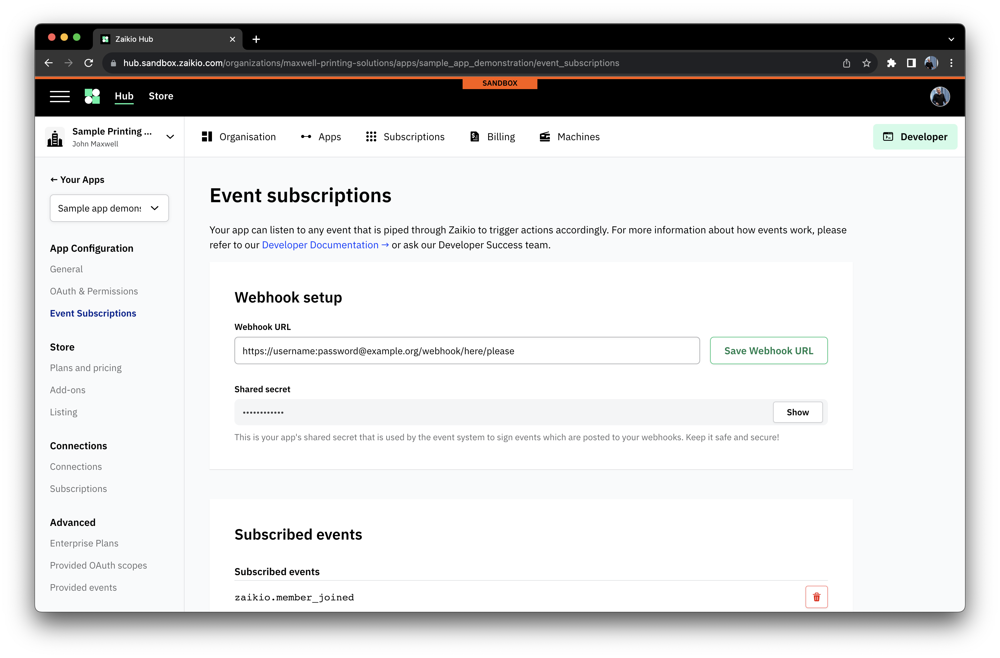

# Receiving Events with Webhooks

[[toc]]

Receiving events with a Webhook is super simple. We've already looked at how to
[subscribe to events](/integration/public-apps.html#events-subscribing-to-changes), and it's very simple to configure the HTTP
endpoint that the platform will send the events matching your subscriptions to.

## Flow

## Setup

### Configuring an endpoint

In the "Event Subscriptions" part of the App configuration, you can set the URL for the Zaikio platform to delivery webhooks to.

This should be set to the URL you wish to receive the webhooks

If you need to use HTTP basic auth to protect your endpoint then you can also add that here

## More information

Can be found in our [guides here](/guide/loom/receiving-events.html), or in the detailed guides to the events emitted by the platform
[located here](/api/platform/guides/resources/events/).
