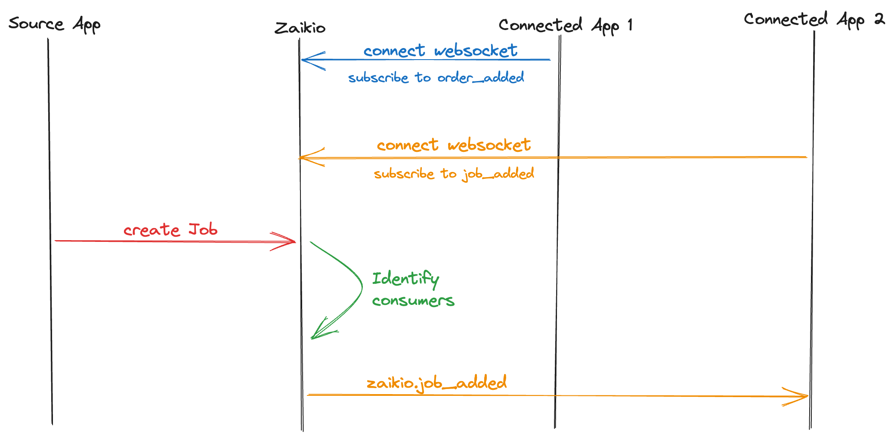
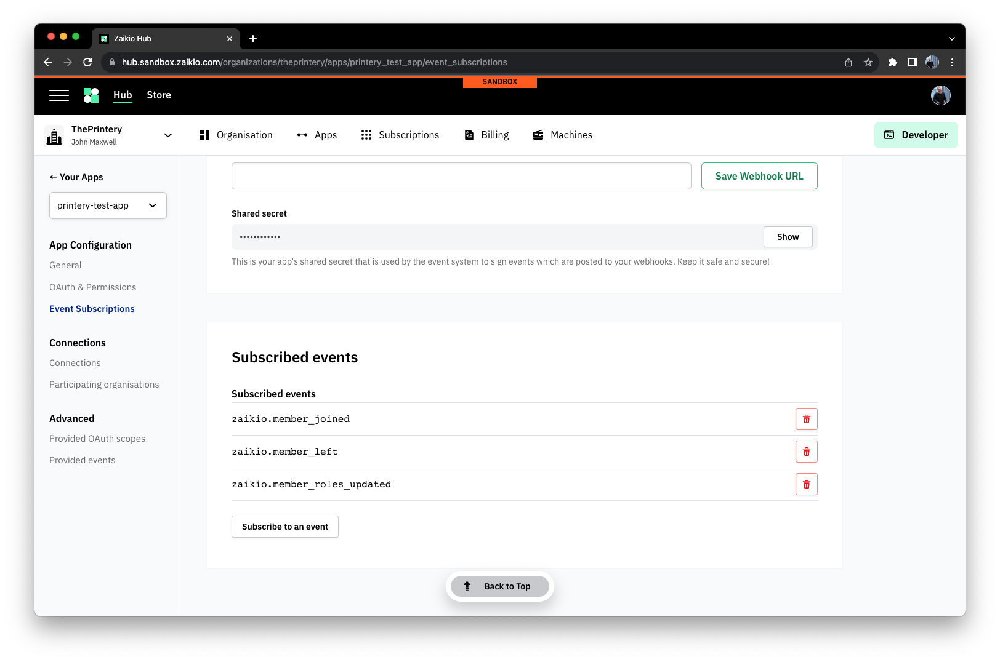

# Receiving Events with Websockets

[[toc]]

## Introduction

Our Websocket delivery mechanism is designed to solve three problematic use-cases
where Webhook delivery is impractical or impossible.

1. The receiving system has no web-server element and thus cannot receive Webhooks
2. The receiving system exists behind a firewall and configuring access is impractical
3. The receiving system operates across many machines with no single central place
  to receive Webhooks

In this situation, we recommend you to implement our Websocket event delivery API.
This prevents the need for inbound requests to penetrate a firewall, and allows apps
to still receive live event notifications to act upon.

Websockets are a robust technology, and almost every programming language under the sun
has a full-featured Websocket client available - some examples are listed on the
[awesome-websockets](https://github.com/facundofarias/awesome-websockets#tools-per-language) web page.

## Flow



## Connecting

Firstly, you will need to setup an application on the Zaikio platform. All of our event
deliveries are scoped to an App. You can find help in doing this in
[our documentation](/integration/)

This will give you access to our HTTP based endpoints for event retrieval, such as this websocket endpoint.

| Environment | Description | URL |
| --- | --- | --- |
| `sandbox` | Used for testing implementations | wss://loom.sandbox.zaikio.com/websocket |
| `production` | Used for live apps | wss://loom.zaikio.com/websocket |

You will need to authorise your application for an Organization, help in doing this can
be found [in the docs](https://docs.zaikio.com/guide/oauth/redirect-flow.html). For most apps, this will be using
the `client_credentials` method after a previous authentication elsewhere. Then you can use this token to subscribe
to our Websocket endpoint.

For each websocket connection, events will only be delivered for the Organization ID that the OAuth token
has been requested for. Receiving events for more than one Organization would require multiple connections,
however we would recommend adopting webhook delivery if that is required.

### Control flow

After the Websocket connection is opened, our server will send a welcome message in the following format

```js
{ type: 'welcome' }
```

Once you have received this, you can send a subscription request.

```js
{
  // subscribe to a channel
  command: 'subscribe',
  identifier: JSON.stringify({
    // a comma-separated list of the events to listen for.
    events: "mission_control.job_added,mission_control.job_updated",
    // the channel name, must be EventChannel
    channel: 'EventChannel'
  }),
}
```

The list of events you wish to subscribe to must already have been defined in your app's event subscriptions. These
can be configured through [the Hub](https://hub.sandbox.zaikio.com) and instructions are
[available here](/integration/public-apps.html#events-subscribing-to-changes).



The server will respond with an acknowledgement of your subscription:

```js
{
  identifier: '{"channel":"EventChannel","events":"mission_control.job_added,mission_control.job_changed"}',
  type: 'confirm_subscription'
}
```

The identifier is passed back to you to help refer to your subscription request if your architecture uses many
subscriptions.

The server then will stream events in realtime as they arrive, and a delivery takes the following shape.

```js
{
  identifier: '{"channel":"EventChannel","events":"mission_control.job_added,mission_control.job_changed"}',
  message: {
    id: 'bd6b9b7f-5ea2-4015-a07a-e3ba15d083cd',
    timestamp: '2023-07-23T22:04:46.000Z',
    name: 'mission_control.job_added',
    version: '1.0',
    payload: { _meta: [Object], job_id: '9e11ad29-7729-46a4-b8a3-937c64ff9cd5' },
    link: 'https://mc.sandbox.zaikio.com/api/v1/jobs/9e11ad29-7729-46a4-b8a3-937c64ff9cd5',
    received_at: '2023-07-23T22:04:46.474Z',
    subject: 'Org/837ebb91-2d4b-4818-a19b-04fea7be8cde'
  }
}
```

Again, the identifier is returned to you for routing purposes, along with the message. All payloads are
JSON encoded over the wire, so will need to be decoded, there is an example of this in NodeJS below.

## Example code

The following is a simple example of how to connect and receive events using the WS library in NodeJS.

```js
import WebSocket from 'ws';

const ws = new WebSocket('wss://loom.sandbox.zaikio.com/websocket', {
   headers: {
      authorization: `Bearer ${proces.env.JWT_TOKEN}`, // auth is passed to the initial request through a Bearer token
   },
});

// This should have more advanced error handling.
ws.on('error', console.error.bind(console));

ws.on('open', () => {
  const msg = {
    // subscribe to a channel
    command: 'subscribe',
    identifier: JSON.stringify({
      // a comma-separated list of the events to listen for.
      events: "mission_control.job_added,mission_control.job_updated",
      // the channel name, must be EventChannel
      channel: 'EventChannel'
    }),
  };

  // send the subscription request
  ws.send(JSON.stringify(msg));
});

ws.on('message', (data) => {
  // parse the received payload
  const msg = JSON.parse(data);

  // Ignores pings.
  if (msg.type === "ping") {
    return;
  }

  // if a message property is present, this is an event being received
  if (msg.message != null) {
    console.log('webhook received', msg.message);
  }
});
```

## Roadmap

- [ ] Allow rewinding event history through Websocket commands
- [ ] Allow ack-ing events through Websocket command
