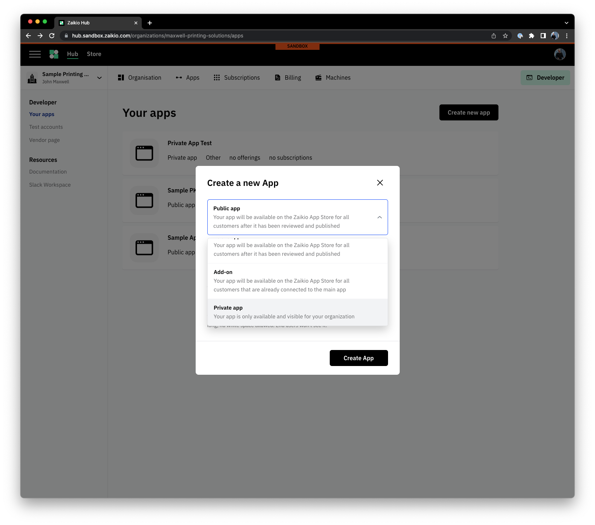

# Internal/one-off integrations with a Private App

It is possible to build an integration with Zaikio by simply issuing a Private Access Token, as discussed in the Getting Started section, however we would not recommend this. Many features of our platform work at their best when used with the power of apps. It's simple to create a Private App that acts as a kind of container for your integration.

Private apps have some nice advantages, such as being automatically connected to your Organization, and allow you to subscribe to Loom events - webhook notifications - which alert you to things changing.

Once you have a private application, your course of action depends a little on whether you're developing interactive software - such as a web-based tool for a front-office to monitor production status, or an automated, server-side piece of software to synchronise data. Although, if you happen to be doing the former - have you heard of [Mission Control](https://zaikio.com/products/mission-control), our single-pane of glass giving a complete overview of where your Jobs are?

Once you have created your private app, it would be worth looking over the "what kind of integration do I need?" list again, and following the steps for the kind of solution you are looking for.

Additionally, the [API Components guide](/integration/api-components.html) can help you identify which sections of our API are most relevant to your use-cases.
