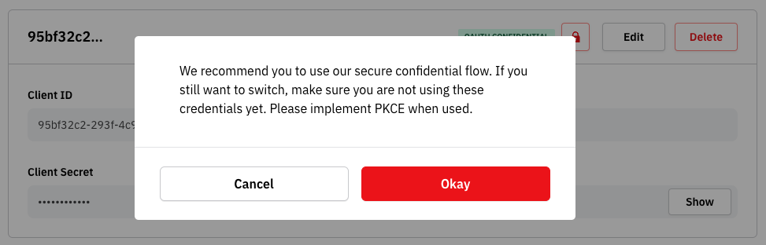
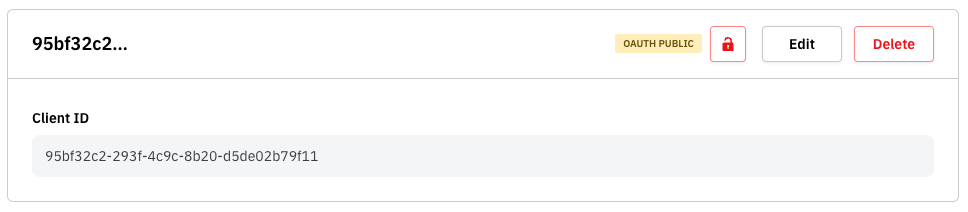

# On-premise Native Applications

Integrations for on-premise native applications are some of the easiest to work with. The special considerations for integration can broadly be grouped into two categories - oAuth and responding to events.

## oAuth

oAuth integrations for on-premise native applications differ to those of server side applications, primarily around the concept of confidentiality. Other than that, all flows and processes remain mostly identical. The points below are specific guides for this integration model, but more information can be found in our main documentation [here](https://docs.zaikio.com/guide/oauth/)

### Confidentiality

Applications deployed in this manner are always classified as _public_ - they have no ability to store an application secret securely. This is most important, as attempting to distribute an oAuth app secret within the application would lead to huge security breaches if the application's source code was ever accessed. This is equally true of compiled, native applications as situations where the source-code is distributed - e.g. a NodeJS application.

_Public_ applications use a slightly different flow to authenticate - PKCE. To read more about this, the [oAuth documentation](https://datatracker.ietf.org/doc/html/rfc6749#section-2.1) is the best place, but to summarise - it removes the need for the application secret, limiting the app to only act on behalf of the currently-authenticated user. If you're using NodeJS then our [Passport](https://github.com/zaikio/passport-zaikio) plugin handles this correctly with a single config option, otherwise please consult the oAuth library of your choice.

To use a PKCE flow, you must mark the credentials as _public_ in your app's settings page. Click the padlock icon next to the credentials you wish you use, and you will be greeted with a popup:



Which, when accepted, will transform the credential to public credentials ready for usage.



### Handling oAuth flows

Your application will need to be able to handle the redirect at the end of the oAuth flow. Since, for security, our platform only accepts pre-defined redirect URLs configured within the App config, you will need to add URL handling capabilities to your application.

To achieve this, the best option is to add a URL handler to the operating system for your application. Fortunately, this is a simple process on most operating systems.

Covering the setup of this this is outside of the scope of our documentation, but the resources required can be found at the following links:

- Apple https://developer.apple.com/documentation/xcode/defining-a-custom-url-scheme-for-your-app
- Windows https://learn.microsoft.com/en-us/windows/win32/search/-search-3x-wds-ph-install-registration
- Android https://developer.android.com/training/app-links/deep-linking

Once you have a handler setup, your app will respond to a url such as `myapp://zaikio/auth/callback` which can be provided to the application configuration in the oAuth section:

Screenshot 2023-06-26 at 09.24.08.png

In the same way as all oAuth flows, once the handshake is completed you will receive an _access token_ and a _refresh token_. The _access token_ is time-limited, and can be exchanged for a new one with the _refresh token_ when that runs out. _Refresh tokens_ are single use, and a replacement will be issued when a refresh is made.

### Secure storage of credentials

Whilst in this integration model the application itself does not contain any app secrets, once authenticated it will receive an access token and a refresh token than can be used to access data. It is always best to store this securely using encryption. The scope of doing this is outside of our advice, however we would advise following platform-specific best-practices to ensure good hygiene.

## Receiving Events

Normally, when a resource is created, updated or destroyed, Loom will send an event notification to an endpoint that your application has defined in its config. This allows you to build reactive applications that respond quickly and effectively to changes in the data.

Unfortunately, due to the nature of these applications, it is unlikely-to-impossible for them to receive webhooks from our Loom event delivery system. This limits the ability to make responsive applications that offer best-in-class behaviours, such as live-updating displays. Fortunately, there is a way around this.

If applications need to respond to changes, it's possible to poll Loom for events.

```bash
curl --request GET \
     --url 'https://loom.zaikio.com/api/v1/events?filter[name]=zaikio.job_added&filter[from]=2023-06-26T10%3A00%3A00&page=1' \
     --header "Authorization: Bearer $YOUR_OAUTH_ACCESS_TOKEN"
     --header 'Content-Type: application/json'
```

Results are paginated, and can be filtered according to the event name or timestamps as follows:

| Parameter name | Description |
| --- | --- |
| filter[name] | The name of the event to return events for |
| filter[from] | A URL-encoded timestamp that marks the earliest an event should be returned from |
| filter[to] | A URL-encoded timestamp that marks the latest an event should be returned to |
| page | The page of results to return |
| per | How many results to return in a page |

Loom will rate limit your requests according to our rate-limiting policies, so consider how regularly you actually need to be alerted to updates. For many applications polling for changes each minute is ample.

If this isn't satisfactory, we would suggest deploying a bridge application as part of your app that does the following:

- subscribes to all Loom events via webhook
- converts these events to some form of native push notification that suits your application
- distributes those push notifications to your application

This would allow you to build more advanced and scalable application topologies but further guides to doing this are outside of the scope of our documentation. Many use-cases can get started and go a long way simply polling for changes though, and we would recommend that as a simple starting point.

In future we will be offering advanced web-socket based  endpoints to allow realtime responses from within the firewall. We'll be communicating this through our community channels as soon as this is available.
