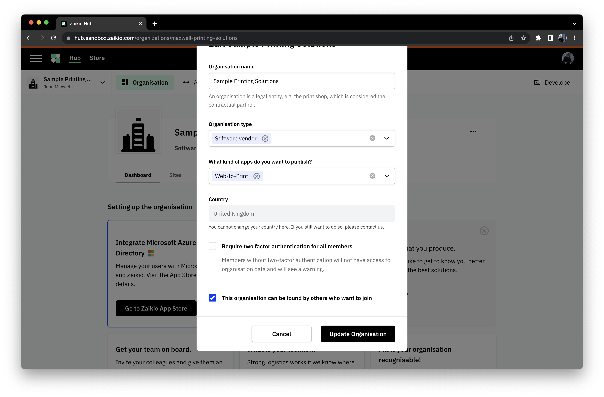
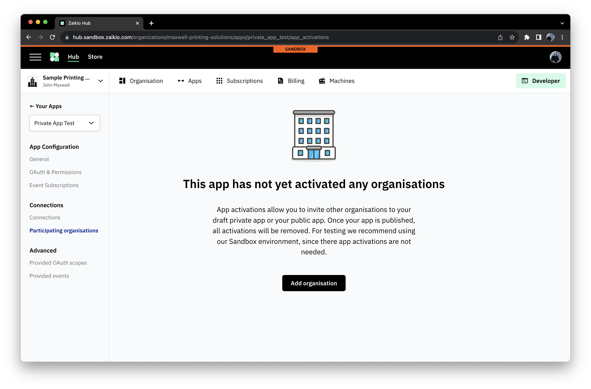
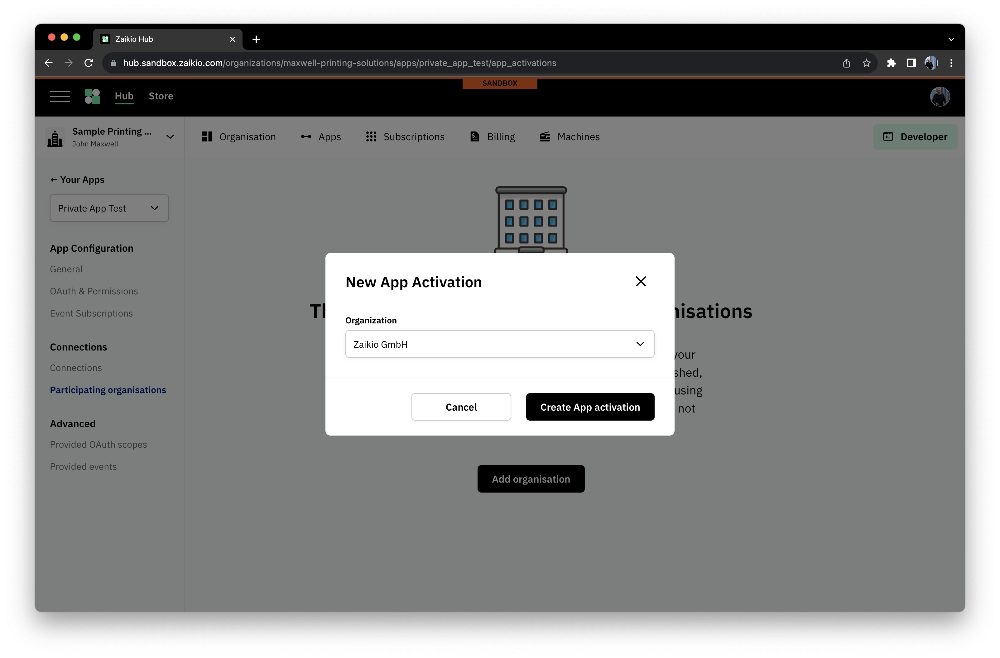
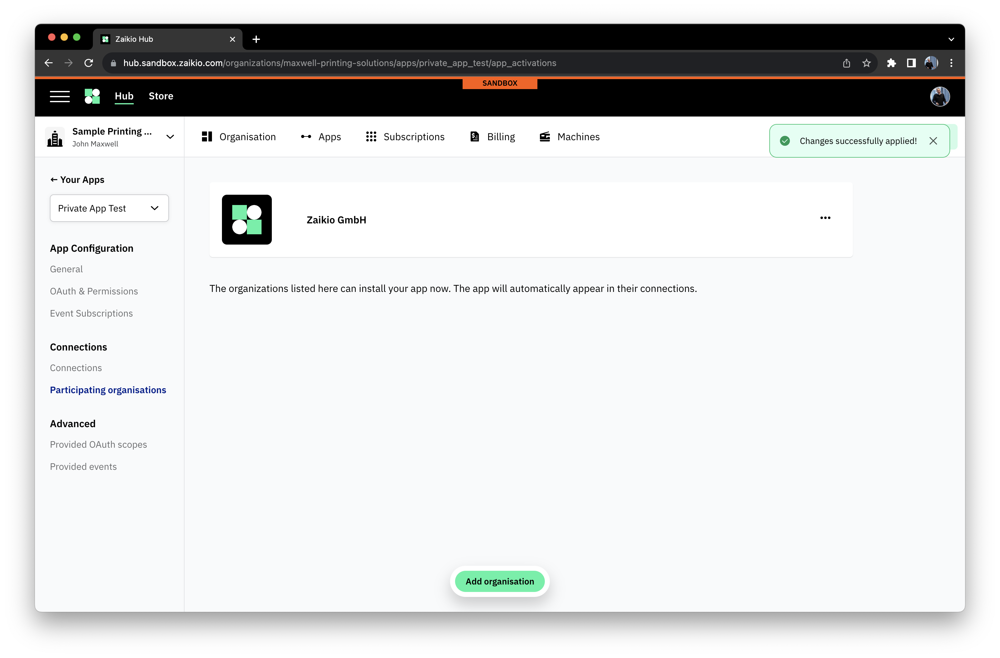
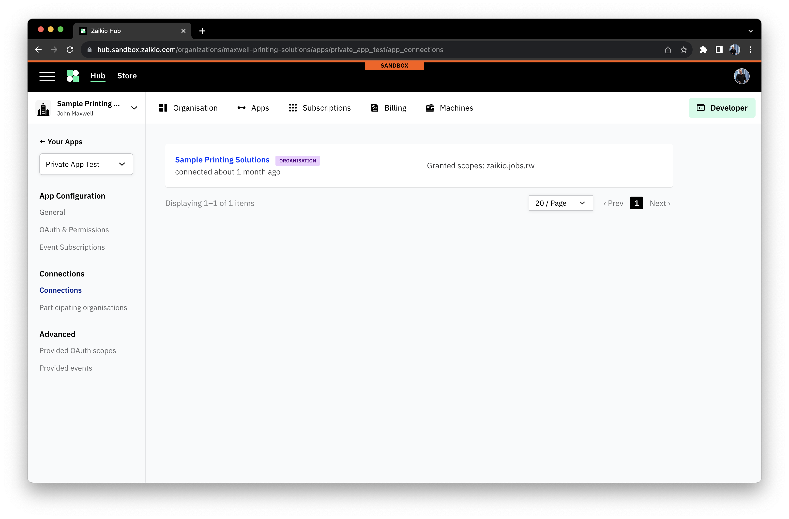
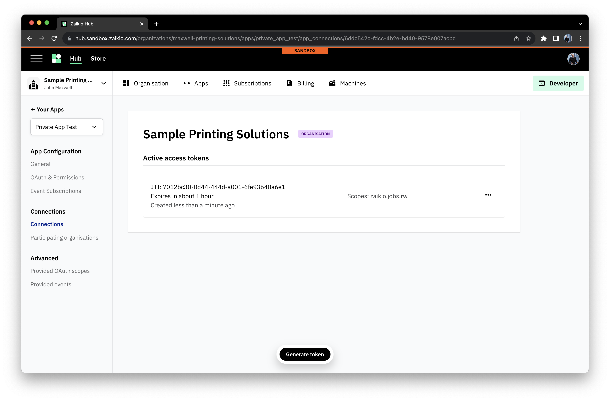
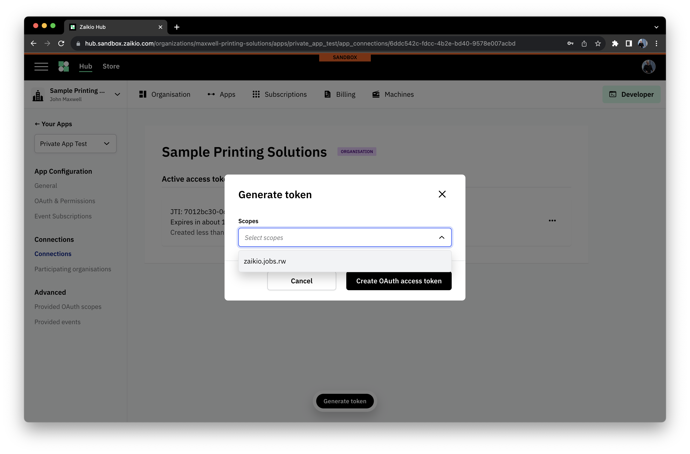
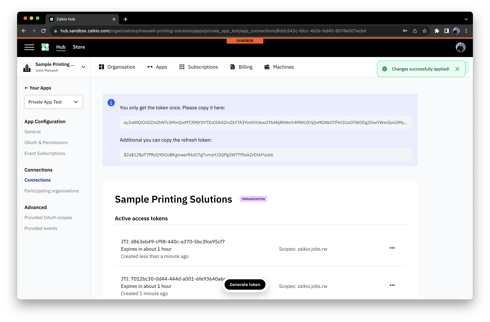

# Private Apps

[[toc]]

## Introduction

Creating a private App is an easy process, and has a really nice advantage for people who are building an App that might not have a
user interface - they are automatically installed into your Organisation when created. When building an internal integration, it's
good to think of the App as a kind of container to access your data that gives you more controls and more flexibility.

When you create a new App, simply select the "Private app" option in the dropdown. This will set the App's visibility to private,
preventing it appearing in the App store, and automatically install the App within your Organisation.

## Setup

### Connecting other Organisations

It's possible to share your private App with other Organisations - in order to do this, two conditions must be met.

1. The Organisation must have their visibility set to be discoverable (this can be done in the Organisation settings page, example below)

2. The App must invite them to join.

## Simple Development

A simple way of accelerating your development is to create your private app, [request scopes]() and [subscribe to events]().
These will automatically be granted for the Organisation that your app is connected to. In the "Connections" section of your
app administration area, you can manually issue JWTs for a given Organisation. Simply view the list of connected Organisations

and pick the Organisation you wish to issue a JWT for.

When clicked on, you can see or revoke any existing tokens, or issue a new one

Finally you are presented with the token and a refresh token to replace it when it expires.

::: tip Validity Period
A token issued in this way has validity for **one hour** before it requires refreshing.
:::

## Comments

Other than those two details, there is nothing special to know about a private App, it supports all of the same concepts as public Apps
do, and you can follow the descriptions of those concepts on the [public App page](./public-apps.html#setup).
