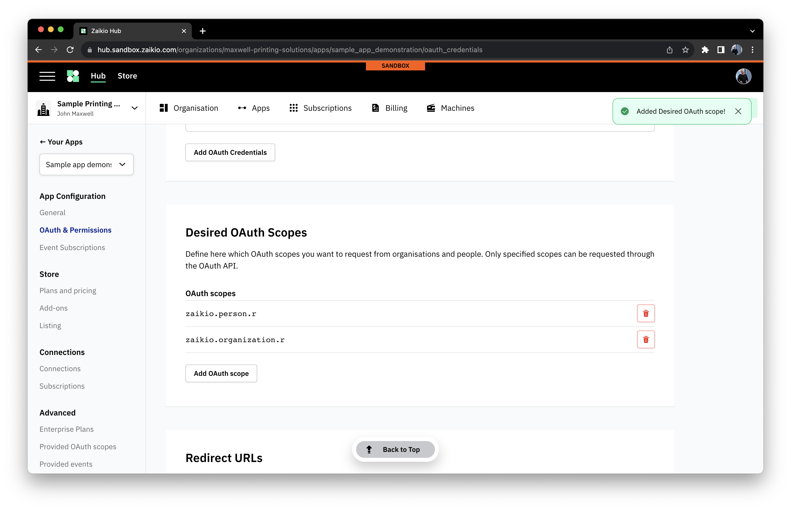

# Public Apps

[[toc]]

## Getting Started - creating the App

Creating a public App, or just an App from here forward, is super simple.


## Setup

### OAuth Scopes - requesting data

OAuth scopes are the core of all interactions with the platform APIs. Apps must request access to the kinds of data they need to use
in order to be able to either read or write that data. The process of adding a scope is incredibly simple. In the management panel
for your new App, select the "OAuth & Permissions" menu option and then scroll to the "Desired OAuth Scopes" panel.

To add a scope, click the "Add OAuth scope" link, and start typing to populate the list of scopes.

Click on the scope you require to add it, and the list will update.

You can then repeat this as many times as you wish. If you have many scopes to add, using AppConfiguration JSON files
can be simpler, and you can read about that below.

**IMPORTANT** Updating the list of desired scopes does not automatically give you access to them _other than for a private app_.
If you amend your desired scopes after Organisations have subscribed to your App, you will need to ask for the permissions
to be updated. This is as simple as following the initial redirect flow again. The person who establishes this connection
will need to have the `owner` or `administrator` role on the Organisation connecting.

### Events - subscribing to changes

As discussed in the introduction, to react when some data changes, you need to subscribe to events. The process for adding event
subscriptions is very similar to adding OAuth scopes. Navigate to the "Event Subscriptions" menu option in your App administration
page. On here you can see two panels.

The first, "Webhook setup" is covered in the guide to [webhook setup](./events-webhooks.html)
and can be ignored if not relevant for your integration. Scroll down a little to "Subscribed events". This starts empty as you can
see here.

To add subscriptions, click the "Subscribe to an event" button and start typing to filter the list to the event you're looking for.

Then, when you've located the relevant event simply click on it to add it.

Events can also be configured through AppConfiguration JSON. Unlike OAuth scopes, new event subscriptions are immediately active with
no further work required.

### Inviting test users

It's simple to test your App with other Organizations by using the invite URL for your App. This can be found in the "General" part
of the App administration area.


### AppConfiguration

A simple way to configure the App in a single place is through the AppConfiguration JSON file. You can download a current copy of
the entireity of your App's config in the "General" part of the App administration page.


The file has a simple structure, as seen below.

```json
{
  "entry_point_url": null,
  "webhook_url": null,
  "category": "other",
  "oauth_redirect_urls": [],
  "translations": [
    {
      "locale": "en",
      "title": "Sample app demonstration",
      "summary": null,
      "description": null
    }
  ],
  "desired_oauth_scopes": [
    "zaikio.organization.r",
    "zaikio.person.r"
  ],
  "subscribed_events": [
    "zaikio.member_joined"
  ],
  "oauth_scopes": [],
  "events": []
}
```

You can make changes to this file and then either upload it through the UI, or you can programatically use our API to make the update.
This is the approach we prefer for our own Apps - ensuring that all changes to config can be carefully audited by our team and reviewed
to make sure that nothing is altered by accident.

The schema for this file is [available here](https://hub.zaikio.com/docs/schemas/AppConfiguration.yml) for validation purposes.

## Tips for success

- Think of a good name up front, whilst you can rename the app, the _technical name_ or permalink of the App cannot change later
- When specifying OAuth scopes for data access, ask for the least access possible - overreach erodes end user trust
- Subscribe to as many events as can offer you help - this can be more than you might think, e.g. if you display the name of
  an Organisation remember to request `zaikio.organization_updated` to ensure you don't miss any updates

## Advanced concepts

### Providing OAuth scopes

Your applications can also become part of third-party ecosystems on our platform by publishing your own OAuth scopes so that other
Apps can authenticate against your API and build on top of your functionality. A great example of this would be an Auditing app that
subscribed to many events from the Zaikio platform, but also wanted external App vendors to be able to create audit entries.

The "Provided OAuth scopes" menu option allows you to set these up.
<!-- and we have a [case study](./case-studies/auditface.html) that discusses the concepts in more depth. -->

It's important to add sensible names and descriptions to add those integrating with your App.


### Providing Events

Our event delivery platform solves one of the hard problems of building applications for you - secure, reliable event delivery from
your App. By setting up Events that would be of interest to other parties, you can notify them of when things happen just like the
Zaikio platform does.

The "Provided events" menu option leads to a page where these can be configured.

It's important when adding an event to add sensible descriptions and sample payloads, as these will be how integrators will
discover your offering.

Finally, the event is added to the platform, and can be edited or discovered by those who have subscribed to your App.

To send events, setup a password and then you can follow our [documentation to send events](/guide/loom/posting-events.html).


